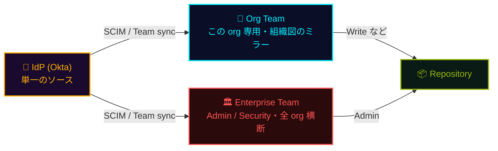

## 一言で

  

    ガバナンスとは <strong>「誰が何をできるか」</strong> を階層で統制すること。
  

  

    リポジトリの <strong>権限ロール</strong>、repo → org → enterprise の <strong>ポリシー</strong>、そして Copilot を一元管理する <strong>managed settings</strong> を押さえる。
  

## Permissions

リポジトリ別にロールを割り当て、誰が何をできるかを制御。ロールは **積み上げ式**で、上位は下位のすべて ＋ α を含む。自分の repo でのロールが分からなければ `gh api repos/OWNER/REPO --jq .permissions` で確認できる。

| ロール | できること（下位ロール ＋ 追加分） |
| --- | --- |
| 👀 Read | 閲覧・clone・Issue 作成 |
| 🔺 Triage | **Read ＋** Issue/PR の整理（ラベル・アサイン・close/reopen） |
| ✍️ Write | **Triage ＋** push・マージ |
| 🛠️ Maintain | **Write ＋** リポジトリ設定の一部管理（非破壊） |
| 👑 Admin | **Maintain ＋** 全権限（アクセス管理・削除・可視性変更） |

> 🧩 既定の 5 ロールが合わなければ、**Organization レベルでカスタムリポジトリロール**を作成できる。任意の base role（Read〜Maintain）に、必要な細粒度権限だけを **足し引き** して独自ロールを定義。<a class="retro-link" href="https://docs.github.com/en/organizations/managing-peoples-access-to-your-organization-with-roles/managing-custom-repository-roles-for-an-organization" target="_blank" rel="noopener noreferrer">Custom repository roles ↗</a>

## 権限の付け方（推奨フロー）

個人に直接付与しない。**IdP（Okta）を単一のソース**にして Enterprise Team と Org Team を provision し、Team を repo に割り当てる。

- 🏛️ **Enterprise Team** — Admin / Security など **全 org 横断**の役割。Enterprise レベルで一度定義
- 🏢 **Org Team** — その org 専用。組織図をミラーし repo に割り当て
- 🪪 どちらも **Okta から provision**（<a class="retro-link" href="/theomonfort/playbook/enterprise-setup">Enterprise Setup ↗</a>）

> 🎯 **最小限の原則:** ① 単一のソース ＝ IdP　② repo アクセスは **Team 経由**　③ 昇格は **追加 Team**　④ **最小権限**

## Policies

ポリシーは **Organization** と **Enterprise** のレベルに存在し、**リポジトリには無い**。repo は上位で許可された範囲を **継承するだけ**。Codespaces マシン・Copilot・Actions などの **機能アクセスは org / enterprise から付与** され、repo 自身に **統制の権限はない**。

- 🏛️ **Enterprise**: 全 org への横断ガードレール（SSO/SCIM・利用可能な機能・基本ポリシー）
- 🏢 **Org**: メンバー権限・repo 作成/公開範囲・2FA・Copilot / Codespaces / Actions のアクセス
- 📦 **Repo**: 継承のみ。上位で有効化された機能を使うだけで、ポリシーは持たない
- 🔁 Enterprise → Org → Repo と下位へ継承（org は厳しくできるが緩められない）

> 🎯 個別設定で消耗しない。ガードレールは org / enterprise から「上から」効かせる。<a class="retro-link" href="https://docs.github.com/en/organizations/managing-organization-settings" target="_blank" rel="noopener noreferrer">Organization policies ↗</a> · <a class="retro-link" href="https://docs.github.com/en/enterprise-cloud@latest/admin/enforcing-policies" target="_blank" rel="noopener noreferrer">Enterprise policies ↗</a>

## Copilot managed settings（NEW）

Enterprise が Copilot クライアント（CLI / VS Code）の設定を **一元統制** する仕組み。source organization の `.github-private` リポジトリに置いた `copilot/managed-settings.json` を、エンタープライズの Copilot ライセンスを持つ全ユーザーへ自動配布する。

**統制できること:**

- 🧠 **既定モデル** — 新規会話の既定モデルを指定（例: Auto model selection）。個別会話では変更可
- 🚫 **バイパスモードの禁止** — YOLO / auto-approve を無効化し、エージェントの各操作を人がレビュー
- 🏪 **プラグイン marketplace** — 追加、またはエンタープライズ承認済みのみに限定
- 🧩 **既定プラグイン** — 全ユーザーに自動インストール

> ⚙️ 解決順: source organization は **エンタープライズにつき 1 つ**（AI controls › Agents で指定）。どの org からライセンスを受けても、適用されるのはこの単一ソースの設定。managed-settings は **クライアント側のユーザー設定より優先** され、クライアントは **1 時間ごと** に取得。<a class="retro-link" href="https://docs.github.com/en/enterprise-cloud@latest/copilot/how-tos/administer-copilot/manage-for-enterprise/manage-agents/configure-enterprise-managed-settings" target="_blank" rel="noopener noreferrer">Configuring enterprise managed settings ↗</a>

## ★ 使いどころ

「誰が何を」を **階層で** 統制するのがガバナンスの核。

| 層 | 対象 | 例 |
| --- | --- | --- |
| 👤 権限ロール | リポジトリ | Read / Write / Admin |
| 🏢 ポリシー | org → enterprise | 2FA 必須・公開範囲・機能アクセス |
| 🤖 managed settings | Copilot クライアント | 既定モデル・バイパス禁止・プラグイン |

> 🎯 個別運用で消耗しない。上位から一括で効かせるのが統制の勝ち筋。
