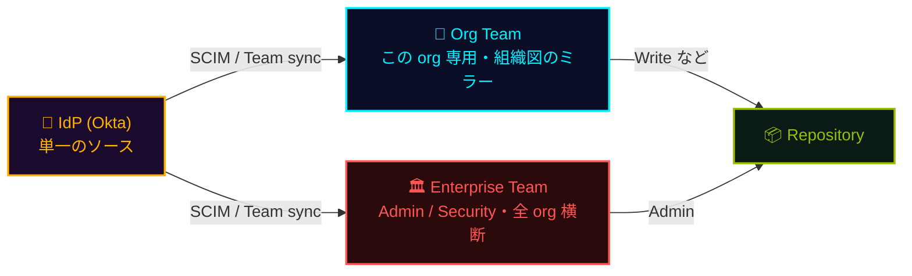

## 一言で

<div class="hero-quote">
  <p>
    ガバナンスとは <strong>「誰が何をできるか」</strong> を階層で統制すること。
  </p>
  <p>
    リポジトリの <strong>権限ロール</strong>、repo → org → enterprise の <strong>ポリシー</strong>、そして Copilot を一元管理する <strong>managed settings</strong> を押さえる。
  </p>
</div>

## Permissions

リポジトリ別にロールを割り当て、誰が何をできるかを制御。ロールは **積み上げ式**で、上位は下位のすべて ＋ α を含む。自分の repo でのロールが分からなければ `gh api repos/OWNER/REPO --jq .permissions` で確認できる。

| ロール | できること（下位ロール ＋ 追加分） |
| --- | --- |
| 👀 Read | 閲覧・clone・Issue 作成 |
| 🔺 Triage | **Read ＋** Issue/PR の整理（ラベル・アサイン・close/reopen） |
| ✍️ Write | **Triage ＋** push・マージ |
| 🛠️ Maintain | **Write ＋** リポジトリ設定の一部管理（非破壊） |
| 👑 Admin | **Maintain ＋** 全権限（アクセス管理・削除・可視性変更） |

> 🧩 既定の 5 ロールが合わなければ、**Organization レベルでカスタムリポジトリロール**を作成できる。任意の base role（Read〜Maintain）に、必要な細粒度権限だけを **足し引き** して独自ロールを定義。<a class="retro-link" href="https://docs.github.com/en/organizations/managing-peoples-access-to-your-organization-with-roles/managing-custom-repository-roles-for-an-organization" target="_blank" rel="noopener noreferrer">Custom repository roles ↗</a>

## 権限の付け方（推奨フロー）

個人に直接付与しない。**IdP（Okta）を単一のソース**にして Enterprise Team と Org Team を provision し、Team を repo に割り当てる。


```mermaid
flowchart LR
  IDP["🪪 IdP (Okta)<br/>単一のソース"]
  ENT["🏛️ Enterprise Team<br/>Admin / Security・全 org 横断"]
  ORG["🏢 Org Team<br/>この org 専用・組織図のミラー"]
  REPO["📦 Repository"]
  IDP -->|SCIM / Team sync| ENT
  IDP -->|SCIM / Team sync| ORG
  ORG -->|Write など| REPO
  ENT -->|Admin| REPO

  classDef idp fill:#1a0a2e,stroke:#ffb000,color:#ffb000,stroke-width:2px
  classDef ent fill:#2a0a0a,stroke:#ff5555,color:#ff5555,stroke-width:2px
  classDef org fill:#0a0e27,stroke:#00f0ff,color:#00f0ff,stroke-width:2px
  classDef repo fill:#0a1a14,stroke:#9bbc0f,color:#9bbc0f,stroke-width:2px
  class IDP idp
  class ENT ent
  class ORG org
  class REPO repo
```

- 🏛️ **Enterprise Team** — Admin / Security など **全 org 横断**の役割。Enterprise レベルで一度定義
- 🏢 **Org Team** — その org 専用。組織図をミラーし repo に割り当て
- 🪪 どちらも **Okta から provision**（<a class="retro-link" href="/theomonfort/playbook/enterprise-setup">Enterprise Setup ↗</a>）

> 🎯 **最小限の原則:** ① 単一のソース ＝ IdP　② repo アクセスは **Team 経由**　③ 昇格は **追加 Team**　④ **最小権限**

## Policies

ポリシーは **Organization** と **Enterprise** のレベルに存在し、**リポジトリには無い**。repo は上位で許可された範囲を **継承するだけ**。Codespaces マシン・Copilot・Actions などの **機能アクセスは org / enterprise から付与** され、repo 自身に **統制の権限はない**。

- 🏛️ **Enterprise**: 全 org への横断ガードレール（SSO/SCIM・利用可能な機能・基本ポリシー）
- 🏢 **Org**: メンバー権限・repo 作成/公開範囲・2FA・Copilot / Codespaces / Actions のアクセス
- 📦 **Repo**: 継承のみ。上位で有効化された機能を使うだけで、ポリシーは持たない
- 🔁 Enterprise → Org → Repo と下位へ継承（org は厳しくできるが緩められない）

> 🎯 個別設定で消耗しない。ガードレールは org / enterprise から「上から」効かせる。<a class="retro-link" href="https://docs.github.com/en/organizations/managing-organization-settings" target="_blank" rel="noopener noreferrer">Organization policies ↗</a> · <a class="retro-link" href="https://docs.github.com/en/enterprise-cloud@latest/admin/enforcing-policies" target="_blank" rel="noopener noreferrer">Enterprise policies ↗</a>

## `.github-private` & source org（NEW）

<div class="hero-quote hero-quote-plain">
  <p>
    GitHub は Copilot の統制を <strong>自分たちが所有しレビューする 1 つのリポジトリ</strong> に集約する。
  </p>
  <p>
    ガードレールは <strong>バージョン管理・レビュー・監査</strong> の対象になる。設定画面のチェックボックスではなく、Pull Request で動かす。
  </p>
</div>

**Enterprise → AI controls → Agents → Configuration source** で **source organization** を指定する。その org の `.github-private` リポジトリが、エージェントとクライアントポリシーの唯一の情報源になる。

```text
.github-private/
├── agents/                     # エンタープライズ全体に公開する custom agent
├── .github/agents/             # ステージング — 公開前に検証できる
└── copilot/
    ├── managed-settings.json   # エンタープライズの基準値
    ├── team-mappings.json      # 設定ファイル → enterprise team のスラッグ
    └── teams/*.json            # チーム単位の特殊化
```

- 🏢 **選ぶのは org であって repo ではない** — `.github-private` という名前と `copilot/managed-settings.json` というパスは固定
- 🔒 **repo へのアクセス可否に関わらず**、エンタープライズの Copilot プラン利用者 **全員に適用**
- 🚀 **エージェントの公開** は `.github/agents/` から `agents/` へファイルを移動するだけ
- 🛡️ CODEOWNERS と `copilot/**` · `agents/**` を対象にした ruleset で **保護** する

> 🎯 repo を **internal** にすれば、誰でも PR で変更を提案できる。統制を開きつつ、マージの権限は握ったままにできる。

## Copilot managed settings（NEW）

`copilot/managed-settings.json` が共通のガードレールを定義し、対応クライアントが自動的に適用する。managed の値は開発者のローカル設定を **上書き** する。対象は **Copilot CLI / VS Code / JetBrains / Copilot app / Copilot cloud agent**（キーごとに対応状況は異なる）。

| キー | 統制できること | 提供時期 |
| --- | --- | --- |
| `model` | 既定モデルを Auto model selection に | 2026-07-01 |
| `permissions.*` | バイパス / YOLO の禁止、危険な操作の拒否・承認必須化 | 2026-06-17 |
| `enabledPlugins` · marketplace 系 | 承認済みプラグインと提供元、`autoUpdate` 対応 | 2026-08-26 |
| `allowedMcpServers` · `deniedMcpServers` | MCP 許可リスト。fail-closed、URL / コマンドで照合 | 2026-08-06 |
| `telemetry` | 自社の collector への OpenTelemetry エクスポート | 2026-07-08 |
| `teams/` + `team-mappings.json` | `overridable` キーのチーム単位の特殊化 | 2026-08-03 |

配布方法は server-managed（このリポジトリ）、**MDM**（Intune / Jamf / グループポリシー）、端末上のファイルの 3 通り。優先順位は **MDM → server-managed → ファイル → ユーザー設定**。

### もっと詳しく

- 📖 <a class="retro-link" href="https://docs.github.com/en/enterprise-cloud@latest/copilot/reference/enterprise-administrators/enterprise-managed-settings" target="_blank" rel="noopener noreferrer">設定リファレンス（全キー） ↗</a> · <a class="retro-link" href="https://docs.github.com/en/enterprise-cloud@latest/copilot/how-tos/administer-copilot/manage-for-enterprise/manage-agents/configure-enterprise-managed-settings" target="_blank" rel="noopener noreferrer">構成ガイド ↗</a>
- 📰 <a class="retro-link" href="https://github.blog/changelog/2026-07-01-enterprise-managed-settings-json-is-generally-available/" target="_blank" rel="noopener noreferrer">GA（2026-07-01） ↗</a> · <a class="retro-link" href="https://github.blog/changelog/2026-07-08-deploy-managed-copilot-settings-via-mdm-in-vs-code-and-cli/" target="_blank" rel="noopener noreferrer">MDM（2026-07-08） ↗</a> · <a class="retro-link" href="https://github.blog/changelog/2026-07-08-enterprise-managed-opentelemetry-export-for-vs-code-and-cli/" target="_blank" rel="noopener noreferrer">OpenTelemetry（2026-07-08） ↗</a>
- 📰 <a class="retro-link" href="https://github.blog/changelog/2026-08-03-enterprise-team-specialization-for-managed-settings/" target="_blank" rel="noopener noreferrer">チーム特殊化（2026-08-03） ↗</a> · <a class="retro-link" href="https://github.blog/changelog/2026-08-06-mcp-allowlists-in-enterprise-managed-settings/" target="_blank" rel="noopener noreferrer">MCP 許可リスト（2026-08-06） ↗</a> · <a class="retro-link" href="https://github.blog/changelog/2026-08-18-enterprise-managed-settings-in-github-copilot-for-jetbrains/" target="_blank" rel="noopener noreferrer">JetBrains（2026-08-18） ↗</a>

## ★ 使いどころ

「誰が何を」を **階層で** 統制するのがガバナンスの核。

| 層 | 対象 | 例 |
| --- | --- | --- |
| 👤 権限ロール | リポジトリ | Read / Write / Admin |
| 🏢 ポリシー | org → enterprise | 2FA 必須・公開範囲・機能アクセス |
| 🤖 managed settings | Copilot クライアント | 既定モデル・バイパス禁止・プラグイン |

> 🎯 個別運用で消耗しない。上位から一括で効かせるのが統制の勝ち筋。
