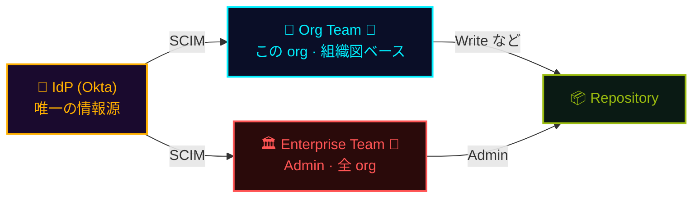

## 一言で

<div class="hero-quote">
  <p>
    ガバナンスは <strong>誰が何をできるか</strong> を決めること。
  </p>
  <p>
    決める順は <strong>org → アクセス → ポリシー → repo</strong>。
  </p>
</div>

## Organization の 3 モデル <a class="h2-doc" href="https://learn.github.com/well-architected/governance/recommendations/governance-administration-essentials" target="_blank" rel="noopener noreferrer">📖 Docs</a> <a class="h2-doc" href="https://octonihon.github.io/events/2026-03-24-GitHub-OctoNihon-Forum/20260324_OctoNihon_Ricoh.pdf" target="_blank" rel="noopener noreferrer">🏢 リコー事例</a>

まず org をいくつ作るか。モデルごとに、全社員が最初から何を見られるかが変わる。

<div class="det-widget det-compact">
<p class="det-hint">▸ モデルをクリック</p>
<div class="det-split">
<div class="det-list">
<details class="det-pick" name="gov-org-model">
<summary class="det-btn"><span class="det-icon" aria-hidden="true">🏛️</span><span class="det-name">1 · 単一 org</span></summary>
<div class="det-pane">
<p class="det-head"><span class="det-icon" aria-hidden="true">🏛️</span><span class="det-title">Single organization</span></p>
<p class="det-why">すべてを 1 つの org に置き、team と repo の権限で分ける。既定では<b>招待された repo しか見えない</b>ので安全だが、そのままだとサイロ化する。<b>全員 team を既定で repo に追加</b>して補う。</p>
</div>
</details>
<details class="det-pick" name="gov-org-model">
<summary class="det-btn"><span class="det-icon" aria-hidden="true">🚦</span><span class="det-name">2 · Red / green</span></summary>
<div class="det-pane">
<p class="det-head"><span class="det-icon" aria-hidden="true">🚦</span><span class="det-title">Red-green-sandbox</span></p>
<p class="det-why">org を <b>3 つ</b>持つ。<b>🟢 Green</b> は既定の置き場で、repo の約 9 割。<b>全社員が最初から読めて push もできる</b>ので InnerSource が回る。<b>🔴 Red</b> は機密用で、<b>招待された人しか中が見えない</b>。<b>🟡 Sandbox</b> は実験場。壊しても困らない場所で、個人 repo を禁止するならその受け皿になる。</p>
</div>
</details>
<details class="det-pick" name="gov-org-model">
<summary class="det-btn"><span class="det-icon" aria-hidden="true">🧩</span><span class="det-name">3 · Portfolio</span></summary>
<div class="det-pane">
<p class="det-head"><span class="det-icon" aria-hidden="true">🧩</span><span class="det-title">Portfolio company</span></p>
<p class="det-why"><b>最上位の事業部</b>（CEO の 1 つ下）ごとに 1 org。組織変更は事業部の中で起きるので影響が出ない。org は enterprise 間を移動でき、M&amp;A に強い。</p>
</div>
</details>
</div>
<div class="det-screen det-has-case"><div class="det-case">
<p class="det-case-k">🏢 事例 — リコー</p>
<p class="det-case-v">部門ごとに org を作る運用で <b>100 以上の org</b> に分裂し、コードが見つからなくなった。全社員が入れる<b>共有 org を 1 つ</b>開いて InnerSource の置き場にし、<b>enterprise の設定とポリシーも Markdown で同じ org に公開</b>した。</p>
</div></div>
</div>
</div>

## アクセスの付け方

次はアクセス。**IdP → team → repo** の順で、個人に直接付けない。


```mermaid
flowchart LR
  IDP["🪪 IdP (Okta)<br/>唯一の情報源"]
  ENT["🏛️ Enterprise Team 📖<br/>Admin · 全 org"]
  ORG["🏢 Org Team 📖<br/>この org · 組織図ベース"]
  REPO["📦 Repository"]
  IDP -->|SCIM| ENT
  IDP -->|SCIM| ORG
  ORG -->|Write など| REPO
  ENT -->|Admin| REPO

  classDef idp fill:#1a0a2e,stroke:#ffb000,color:#ffb000,stroke-width:2px
  classDef ent fill:#2a0a0a,stroke:#ff5555,color:#ff5555,stroke-width:2px
  classDef org fill:#0a0e27,stroke:#00f0ff,color:#00f0ff,stroke-width:2px
  classDef repo fill:#0a1a14,stroke:#9bbc0f,color:#9bbc0f,stroke-width:2px
  class IDP idp
  class ENT ent
  class ORG org
  class REPO repo

  click ENT href "https://docs.github.com/en/enterprise-cloud@latest/admin/managing-accounts-and-repositories/managing-users-in-your-enterprise/create-enterprise-teams" "Enterprise teams のドキュメント" _blank
  click ORG href "https://docs.github.com/en/organizations/organizing-members-into-teams/about-teams" "Organization teams のドキュメント" _blank
```

## Policies

人は入った。次は何をしてよいか。org と enterprise で決め、repo では決めない。

- 🏛️ **Enterprise** — SSO / SCIM、使える機能、全 org の基準
- 🏢 **Org** — メンバー権限、repo 作成、2FA、Copilot と Actions
- 📦 **Repo** — 継承するだけ。機能を使う側で、ポリシーは持たない。
- 🔁 ルールは**下**に流れる。org は厳しくできるが、緩められない。

> 🎯 ガードレールは上から。repo ごとに設定しない。 <a class="retro-link" href="https://docs.github.com/en/organizations/managing-organization-settings" target="_blank" rel="noopener noreferrer">Org policies ↗</a> · <a class="retro-link" href="https://docs.github.com/en/enterprise-cloud@latest/admin/enforcing-policies" target="_blank" rel="noopener noreferrer">Enterprise policies ↗</a>

## リポジトリ権限ロール

ポリシーが「できること」、repo ロールが「誰がやるか」。ロールは積み上げ式。

<div class="tbl-compact">

| ロール | 下のロールに足されるもの |
| --- | --- |
| 👀 Read | 閲覧、clone、issue 作成 |
| 🔺 Triage | issue と PR の管理 — label、担当、close |
| ✍️ Write | push と merge |
| 🛠️ Maintain | 破壊的でない repo 設定 |
| 👑 Admin | 全権 — アクセス、公開範囲、削除 |

</div>

> 🧩 合うものがなければ、org レベルで**カスタムロール**を作る。 <a class="retro-link" href="https://docs.github.com/en/organizations/managing-peoples-access-to-your-organization-with-roles/managing-custom-repository-roles-for-an-organization" target="_blank" rel="noopener noreferrer">Custom roles ↗</a>

## 12 のアンチパターン

構造は以上。次はそれを壊すもの。**01、02、11 は後から直しにくい。**

<div class="grd-widget grd-compact">
<p class="grd-hint">▸ 数字をクリック — 何が起きるか、どう直すか</p>
<div class="grd-split">
<div class="grd-board">
<details class="grd-pick" name="gov-anti">
<summary class="grd-btn"><span class="grd-num">01</span><span class="grd-name">team ごとに org</span></summary>
<div class="grd-pane">
<p class="grd-head"><span class="grd-num">01</span><span class="grd-title">team やプロジェクトごとに org を作る</span></p>
<p class="grd-row"><span class="grd-k">❌ 結果</span><span class="grd-v">協業が分断され、管理が倍増し、innersource が機能しない。</span></p>
<p class="grd-row"><span class="grd-k">✅ 代わりに</span><span class="grd-v">1 つの org の中で <b>team と repo 権限</b>で線を引く。</span></p>
</div>
</details>
<details class="grd-pick" name="gov-anti">
<summary class="grd-btn"><span class="grd-num">02</span><span class="grd-name">org = 組織図</span></summary>
<div class="grd-pane">
<p class="grd-head"><span class="grd-num">02</span><span class="grd-title">org を管理階層にそのまま合わせる</span></p>
<p class="grd-row"><span class="grd-k">❌ 結果</span><span class="grd-v">組織変更のたびに GitHub 側の作り直しが発生する。</span></p>
<p class="grd-row"><span class="grd-k">✅ 代わりに</span><span class="grd-v">合わせるなら<b>最上位で動かない事業部</b>だけ。合わせなくてもよい。</span></p>
</div>
</details>
<details class="grd-pick" name="gov-anti">
<summary class="grd-btn"><span class="grd-num">03</span><span class="grd-name">base が Admin</span></summary>
<div class="grd-pane">
<p class="grd-head"><span class="grd-num">03</span><span class="grd-title">base permission を Admin にする</span></p>
<p class="grd-row"><span class="grd-k">❌ 結果</span><span class="grd-v">全メンバーが全 repo に破壊的な操作をできる。</span></p>
<p class="grd-row"><span class="grd-k">✅ 代わりに</span><span class="grd-v">base は <b>Read か Write</b>。昇格は team 経由。</span></p>
</div>
</details>
<details class="grd-pick" name="gov-anti">
<summary class="grd-btn"><span class="grd-num">04</span><span class="grd-name">Actions 全許可</span></summary>
<div class="grd-pane">
<p class="grd-head"><span class="grd-num">04</span><span class="grd-title">審査なしで「すべての actions を許可」</span></p>
<p class="grd-row"><span class="grd-k">❌ 結果</span><span class="grd-v">未検証のサードパーティ action がビルドへの侵入経路になる。</span></p>
<p class="grd-row"><span class="grd-k">✅ 代わりに</span><span class="grd-v"><b>許可リスト</b>を持ち、action は <b>commit SHA</b> で固定する。</span></p>
</div>
</details>
<details class="grd-pick" name="gov-anti">
<summary class="grd-btn"><span class="grd-num">05</span><span class="grd-name">支出上限なし</span></summary>
<div class="grd-pane">
<p class="grd-head"><span class="grd-num">05</span><span class="grd-title">spending limit を無制限のまま使う</span></p>
<p class="grd-row"><span class="grd-k">❌ 結果</span><span class="grd-v">請求書払いは既定が無制限なので、超過に気づけない。</span></p>
<p class="grd-row"><span class="grd-k">✅ 代わりに</span><span class="grd-v">上限を明示し、<b>cost center</b> で追跡する。</span></p>
</div>
</details>
<details class="grd-pick" name="gov-anti">
<summary class="grd-btn"><span class="grd-num">06</span><span class="grd-name">手動で招待</span></summary>
<div class="grd-pane">
<p class="grd-head"><span class="grd-num">06</span><span class="grd-title">ユーザー管理を手動招待だけで回す</span></p>
<p class="grd-row"><span class="grd-k">❌ 結果</span><span class="grd-v">退職者のアクセスが残る。剥がす仕組みがないため。</span></p>
<p class="grd-row"><span class="grd-k">✅ 代わりに</span><span class="grd-v">IdP からの <b>SCIM</b> による付与と剥奪。</span></p>
</div>
</details>
<details class="grd-pick" name="gov-anti">
<summary class="grd-btn"><span class="grd-num">07</span><span class="grd-name">API ポーリング</span></summary>
<div class="grd-pane">
<p class="grd-head"><span class="grd-num">07</span><span class="grd-title">webhook を使わず API をポーリングする</span></p>
<p class="grd-row"><span class="grd-k">❌ 結果</span><span class="grd-v">rate limit を消費し、得るものなく負荷だけ増える。</span></p>
<p class="grd-row"><span class="grd-k">✅ 代わりに</span><span class="grd-v">イベント駆動の <b>webhook</b>。</span></p>
</div>
</details>
<details class="grd-pick" name="gov-anti">
<summary class="grd-btn"><span class="grd-num">08</span><span class="grd-name">監査ログの保持</span></summary>
<div class="grd-pane">
<p class="grd-head"><span class="grd-num">08</span><span class="grd-title">監査ログの保持期間を放置する</span></p>
<p class="grd-row"><span class="grd-k">❌ 結果</span><span class="grd-v">既定の保持は短く、必要なときに証跡が残っていない。</span></p>
<p class="grd-row"><span class="grd-k">✅ 代わりに</span><span class="grd-v"><b>監査ログのストリーミング</b>かエクスポートを設定する。</span></p>
</div>
</details>
<details class="grd-pick" name="gov-anti">
<summary class="grd-btn"><span class="grd-num">09</span><span class="grd-name">org ごとに app</span></summary>
<div class="grd-pane">
<p class="grd-head"><span class="grd-num">09</span><span class="grd-title">全社共通の app を org ごとに入れる</span></p>
<p class="grd-row"><span class="grd-k">❌ 結果</span><span class="grd-v">管理が倍増し、承認が散らばり、設定がずれていく。</span></p>
<p class="grd-row"><span class="grd-k">✅ 代わりに</span><span class="grd-v"><b>enterprise レベル</b>で GitHub App を導入する。</span></p>
</div>
</details>
<details class="grd-pick" name="gov-anti">
<summary class="grd-btn"><span class="grd-num">10</span><span class="grd-name">何でも Owner</span></summary>
<div class="grd-pane">
<p class="grd-head"><span class="grd-num">10</span><span class="grd-title">カスタムロールで足りるのに Owner を配る</span></p>
<p class="grd-row"><span class="grd-k">❌ 結果</span><span class="grd-v">Enterprise / Org Owner は実際の必要範囲より広すぎる。</span></p>
<p class="grd-row"><span class="grd-k">✅ 代わりに</span><span class="grd-v">用途を 1 つに絞った<b>カスタムロール</b>。</span></p>
</div>
</details>
<details class="grd-pick" name="gov-anti">
<summary class="grd-btn"><span class="grd-num">11</span><span class="grd-name">後からモデル変更</span></summary>
<div class="grd-pane">
<p class="grd-head"><span class="grd-num">11</span><span class="grd-title">運用開始後にユーザーモデルを変える</span></p>
<p class="grd-row"><span class="grd-k">❌ 結果</span><span class="grd-v">Standard ↔ EMU は設定変更ではなく移行作業。</span></p>
<p class="grd-row"><span class="grd-k">✅ 代わりに</span><span class="grd-v"><b>enterprise を作る時点</b>で決める。</span></p>
</div>
</details>
<details class="grd-pick" name="gov-anti">
<summary class="grd-btn"><span class="grd-num">12</span><span class="grd-name">退職処理なし</span></summary>
<div class="grd-pane">
<p class="grd-head"><span class="grd-num">12</span><span class="grd-title">オフボーディングの経路がない</span></p>
<p class="grd-row"><span class="grd-k">❌ 結果</span><span class="grd-v">休眠アカウントがアクセスとライセンスを持ち続ける。</span></p>
<p class="grd-row"><span class="grd-k">✅ 代わりに</span><span class="grd-v"><b>Unaffiliated users ポリシー</b>と SCIM での剥奪。</span></p>
</div>
</details>
</div>
<div class="grd-screen"><p class="grd-empty">SELECT A NUMBER ▸</p></div>
</div>
</div>

## 18 項目のガードレール <a class="h2-doc" href="https://learn.github.com/well-architected/governance/recommendations/governance-policies-best-practices" target="_blank" rel="noopener noreferrer">📖 Docs</a>

設定する値と、設定する場所。**時間がなければ 03、15、18。**

<div class="grd-widget grd-compact">
<p class="grd-hint">▸ 数字をクリック · ENT / ORG / REPO = 設定する場所</p>
<div class="grd-split">
<div class="grd-board">
<details class="grd-pick" name="gov-guard">
<summary class="grd-btn"><span class="grd-num">01</span><span class="grd-name">Actions の範囲</span></summary>
<div class="grd-pane">
<p class="grd-head"><span class="grd-num">01</span><span class="grd-title">Actions execution scope</span><span class="grd-lvl">ORG</span></p>
<p class="grd-row"><span class="grd-k">⚙️ 設定</span><span class="grd-v">全 repo ではなく<b>特定の repo</b> に限定する。</span></p>
</div>
</details>
<details class="grd-pick" name="gov-guard">
<summary class="grd-btn"><span class="grd-num">02</span><span class="grd-name">使える actions</span></summary>
<div class="grd-pane">
<p class="grd-head"><span class="grd-num">02</span><span class="grd-title">Allowed actions</span><span class="grd-lvl">ENT</span></p>
<p class="grd-row"><span class="grd-k">⚙️ 設定</span><span class="grd-v"><b>GitHub 製と Verified Creator</b> のみ。</span></p>
</div>
</details>
<details class="grd-pick" name="gov-guard">
<summary class="grd-btn"><span class="grd-num">03</span><span class="grd-name">workflow token</span></summary>
<div class="grd-pane">
<p class="grd-head"><span class="grd-num">03</span><span class="grd-title">Default workflow token</span><span class="grd-lvl">ENT / ORG</span></p>
<p class="grd-row"><span class="grd-k">⚙️ 設定</span><span class="grd-v"><b>read-only</b>。既定は read/write。</span></p>
<p class="grd-row"><span class="grd-k">💡 理由</span><span class="grd-v">token が漏れると Actions 経由で書き込まれる。</span></p>
</div>
</details>
<details class="grd-pick" name="gov-guard">
<summary class="grd-btn"><span class="grd-num">04</span><span class="grd-name">PR 自動承認</span></summary>
<div class="grd-pane">
<p class="grd-head"><span class="grd-num">04</span><span class="grd-title">PR auto-approval</span><span class="grd-lvl">ENT / ORG</span></p>
<p class="grd-row"><span class="grd-k">⚙️ 設定</span><span class="grd-v"><b>無効</b>。既定は有効。</span></p>
<p class="grd-row"><span class="grd-k">💡 理由</span><span class="grd-v">コードレビューを迂回して merge できてしまう。</span></p>
</div>
</details>
<details class="grd-pick" name="gov-guard">
<summary class="grd-btn"><span class="grd-num">05</span><span class="grd-name">fork</span></summary>
<div class="grd-pane">
<p class="grd-head"><span class="grd-num">05</span><span class="grd-title">Repository forking</span><span class="grd-lvl">ENT / ORG</span></p>
<p class="grd-row"><span class="grd-k">⚙️ 設定</span><span class="grd-v">必要が明確な repo 以外は<b>オフ</b>。</span></p>
</div>
</details>
<details class="grd-pick" name="gov-guard">
<summary class="grd-btn"><span class="grd-num">06</span><span class="grd-name">公開範囲の変更</span></summary>
<div class="grd-pane">
<p class="grd-head"><span class="grd-num">06</span><span class="grd-title">Repository visibility change</span><span class="grd-lvl">ENT / ORG</span></p>
<p class="grd-row"><span class="grd-k">⚙️ 設定</span><span class="grd-v">公開範囲を変えられる<b>人</b>を絞る。</span></p>
</div>
</details>
<details class="grd-pick" name="gov-guard">
<summary class="grd-btn"><span class="grd-num">07</span><span class="grd-name">Fine-grained PAT</span></summary>
<div class="grd-pane">
<p class="grd-head"><span class="grd-num">07</span><span class="grd-title">Fine-grained PATs</span><span class="grd-lvl">ENT / ORG</span></p>
<p class="grd-row"><span class="grd-k">⚙️ 設定</span><span class="grd-v"><b>承認フロー</b>を必須にする。</span></p>
<p class="grd-row"><span class="grd-k">💡 理由</span><span class="grd-v">誰がどの権限で何に触れるかを審査できる。</span></p>
</div>
</details>
<details class="grd-pick" name="gov-guard">
<summary class="grd-btn"><span class="grd-num">08</span><span class="grd-name">外部コラボ</span></summary>
<div class="grd-pane">
<p class="grd-head"><span class="grd-num">08</span><span class="grd-title">Outside collaborators</span><span class="grd-lvl">ENT</span></p>
<p class="grd-row"><span class="grd-k">⚙️ 設定</span><span class="grd-v"><b>Owner のみ</b>。既定は「No policy」で誰でも招待できる。</span></p>
</div>
</details>
<details class="grd-pick" name="gov-guard">
<summary class="grd-btn"><span class="grd-num">09</span><span class="grd-name">public repo</span></summary>
<div class="grd-pane">
<p class="grd-head"><span class="grd-num">09</span><span class="grd-title">Creating public repositories</span><span class="grd-lvl">ENT</span></p>
<p class="grd-row"><span class="grd-k">⚙️ 設定</span><span class="grd-v">OSS を別途統制しないなら<b>禁止</b>。</span></p>
</div>
</details>
<details class="grd-pick" name="gov-guard">
<summary class="grd-btn"><span class="grd-num">10</span><span class="grd-name">webhook secret</span></summary>
<div class="grd-pane">
<p class="grd-head"><span class="grd-num">10</span><span class="grd-title">Webhook secret</span><span class="grd-lvl">ORG / REPO</span></p>
<p class="grd-row"><span class="grd-k">⚙️ 設定</span><span class="grd-v"><b>必ず設定</b>。受信側で署名を検証できる。</span></p>
</div>
</details>
<details class="grd-pick" name="gov-guard">
<summary class="grd-btn"><span class="grd-num">11</span><span class="grd-name">webhook SSL</span></summary>
<div class="grd-pane">
<p class="grd-head"><span class="grd-num">11</span><span class="grd-title">Webhook transport</span><span class="grd-lvl">ORG / REPO</span></p>
<p class="grd-row"><span class="grd-k">⚙️ 設定</span><span class="grd-v">すべてのエンドポイントで <b>SSL</b>。</span></p>
</div>
</details>
<details class="grd-pick" name="gov-guard">
<summary class="grd-btn"><span class="grd-num">12</span><span class="grd-name">ruleset</span></summary>
<div class="grd-pane">
<p class="grd-head"><span class="grd-num">12</span><span class="grd-title">Repository rulesets</span><span class="grd-lvl">ENT / ORG / REPO</span></p>
<p class="grd-row"><span class="grd-k">⚙️ 設定</span><span class="grd-v">レビュー、チェック、ブランチ保護は ruleset で行う。</span></p>
</div>
</details>
<details class="grd-pick" name="gov-guard">
<summary class="grd-btn"><span class="grd-num">13</span><span class="grd-name">CODEOWNERS</span></summary>
<div class="grd-pane">
<p class="grd-head"><span class="grd-num">13</span><span class="grd-title">CODEOWNERS</span><span class="grd-lvl">REPO</span></p>
<p class="grd-row"><span class="grd-k">⚙️ 設定</span><span class="grd-v"><code>.github/</code> に置き、パスごとに責任者を明示する。</span></p>
</div>
</details>
<details class="grd-pick" name="gov-guard">
<summary class="grd-btn"><span class="grd-num">14</span><span class="grd-name">コミット署名</span></summary>
<div class="grd-pane">
<p class="grd-head"><span class="grd-num">14</span><span class="grd-title">Commit signing</span><span class="grd-lvl">REPO</span></p>
<p class="grd-row"><span class="grd-k">⚙️ 設定</span><span class="grd-v">可能な範囲で<b>必須</b>にする。</span></p>
<p class="grd-row"><span class="grd-k">💡 理由</span><span class="grd-v">commit injection を防ぐ。Copilot cloud agent の commit は署名済み。</span></p>
</div>
</details>
<details class="grd-pick" name="gov-guard">
<summary class="grd-btn"><span class="grd-num">15</span><span class="grd-name">ruleset bypass</span></summary>
<div class="grd-pane">
<p class="grd-head"><span class="grd-num">15</span><span class="grd-title">Bypassing rulesets</span><span class="grd-lvl">REPO</span></p>
<p class="grd-row"><span class="grd-k">⚙️ 設定</span><span class="grd-v"><b>許可しない</b>。bypass 付きの ruleset は「お願い」でしかない。</span></p>
</div>
</details>
<details class="grd-pick" name="gov-guard">
<summary class="grd-btn"><span class="grd-num">16</span><span class="grd-name">runner group</span></summary>
<div class="grd-pane">
<p class="grd-head"><span class="grd-num">16</span><span class="grd-title">Runner groups</span><span class="grd-lvl">ENT / ORG</span></p>
<p class="grd-row"><span class="grd-k">⚙️ 設定</span><span class="grd-v">各グループを<b>限られた repo</b> に割り当てる。</span></p>
<p class="grd-row"><span class="grd-k">💡 理由</span><span class="grd-v">全 repo に開いたグループは self-hosted runner を晒す。</span></p>
</div>
</details>
<details class="grd-pick" name="gov-guard">
<summary class="grd-btn"><span class="grd-num">17</span><span class="grd-name">push protection</span></summary>
<div class="grd-pane">
<p class="grd-head"><span class="grd-num">17</span><span class="grd-title">Push protection bypass</span><span class="grd-lvl">ORG</span></p>
<p class="grd-row"><span class="grd-k">⚙️ 設定</span><span class="grd-v"><b>指定のロールと team</b> に限定。既定では write 権限者なら回避できる。</span></p>
</div>
</details>
<details class="grd-pick" name="gov-guard">
<summary class="grd-btn"><span class="grd-num">18</span><span class="grd-name">監査ログ配信</span></summary>
<div class="grd-pane">
<p class="grd-head"><span class="grd-num">18</span><span class="grd-title">Audit log streaming</span><span class="grd-lvl">ENT</span></p>
<p class="grd-row"><span class="grd-k">⚙️ 設定</span><span class="grd-v">SIEM やオブジェクトストレージへ<b>設定する</b>。</span></p>
<p class="grd-row"><span class="grd-k">💡 理由</span><span class="grd-v">最も忘れられがちで、不正検知には最も効く。</span></p>
</div>
</details>
</div>
<div class="grd-screen"><p class="grd-empty">SELECT A NUMBER ▸</p></div>
</div>
</div>

## Copilot managed settings（NEW）

Copilot クライアントも同じ。`copilot/managed-settings.json` がローカル設定を上書きする。優先順位は **MDM → server-managed → file → user**。<a class="retro-link" href="https://docs.github.com/en/enterprise-cloud@latest/copilot/reference/enterprise-administrators/enterprise-managed-settings" target="_blank" rel="noopener noreferrer">全キー ↗</a>

<div class="spec-widget spec-compact">
<p class="spec-hint">▸ + でキーの内容 · 日付は changelog</p>
<div class="spec-list">
<details class="spec-item" name="managed-settings">
<summary class="spec-btn"><span class="spec-icon" aria-hidden="true">🧠</span><span class="spec-key"><code>model</code></span><a class="spec-since" href="https://github.blog/changelog/2026-07-01-enterprises-can-default-to-auto-model-selection/" target="_blank" rel="noopener noreferrer">2026-07-01</a><span class="spec-toggle" aria-hidden="true"></span></summary>
<p class="spec-what"><b>auto model selection</b> を既定にし、手動でモデルを選ばせない。</p>
</details>
<details class="spec-item" name="managed-settings">
<summary class="spec-btn"><span class="spec-icon" aria-hidden="true">🚧</span><span class="spec-key"><code>permissions.*</code></span><a class="spec-since" href="https://github.blog/changelog/2026-06-17-enterprise-managed-settings-now-support-bypass-permission-controls" target="_blank" rel="noopener noreferrer">2026-06-17</a><span class="spec-toggle" aria-hidden="true"></span></summary>
<p class="spec-what"><b>bypass / YOLO モード</b>を禁止し、危険な操作を承認制にする。</p>
</details>
<details class="spec-item" name="managed-settings">
<summary class="spec-btn"><span class="spec-icon" aria-hidden="true">🧩</span><span class="spec-key"><code>enabledPlugins</code> · marketplaces</span><a class="spec-since" href="https://github.blog/changelog/2026-08-26-enterprise-managed-settings-now-support-autoupdate-for-plugin-marketplaces" target="_blank" rel="noopener noreferrer">2026-08-26</a><span class="spec-toggle" aria-hidden="true"></span></summary>
<p class="spec-what">動かすプラグインと配布元を承認する。<b>autoUpdate</b> にも対応。</p>
</details>
<details class="spec-item" name="managed-settings">
<summary class="spec-btn"><span class="spec-icon" aria-hidden="true">🔌</span><span class="spec-key"><code>allowedMcpServers</code> · <code>deniedMcpServers</code></span><a class="spec-since" href="https://github.blog/changelog/2026-08-06-mcp-allowlists-in-enterprise-managed-settings/" target="_blank" rel="noopener noreferrer">2026-08-06</a><span class="spec-toggle" aria-hidden="true"></span></summary>
<p class="spec-what">URL / コマンドで MCP を許可制に。<b>fail-closed</b> で、リスト外は動かない。</p>
</details>
<details class="spec-item" name="managed-settings">
<summary class="spec-btn"><span class="spec-icon" aria-hidden="true">📡</span><span class="spec-key"><code>telemetry</code></span><a class="spec-since" href="https://github.blog/changelog/2026-07-08-enterprise-managed-opentelemetry-export-for-vs-code-and-cli/" target="_blank" rel="noopener noreferrer">2026-07-08</a><span class="spec-toggle" aria-hidden="true"></span></summary>
<p class="spec-what">自社のコレクタへ <b>OpenTelemetry</b> で送る。</p>
</details>
<details class="spec-item" name="managed-settings">
<summary class="spec-btn"><span class="spec-icon" aria-hidden="true">👥</span><span class="spec-key"><code>teams/</code> + <code>team-mappings.json</code></span><a class="spec-since" href="https://github.blog/changelog/2026-08-03-enterprise-team-specialization-for-managed-settings/" target="_blank" rel="noopener noreferrer">2026-08-03</a><span class="spec-toggle" aria-hidden="true"></span></summary>
<p class="spec-what">共通の基準に加え、<b>上書き可</b>のキーだけ team ごとに変える。</p>
</details>
</div>
</div>

## `.github-private` & source org

置き場所は自分が持つ 1 つの repo。**Enterprise → AI controls → Agents** で指定する。

<div class="pre-compact">

```text
.github-private/
├── agents/                    # enterprise 全体に公開
├── .github/agents/            # 検証用ステージング
└── copilot/
    ├── managed-settings.json  # 基準となる設定
    ├── team-mappings.json     # file → enterprise team
    └── teams/*.json           # team ごとの上書き
```

</div>

- 🏢 選べるのは **org** だけ。repo 名と `copilot/` のパスは固定。
- 🔒 repo アクセスの有無に関係なく**プラン全員**に効く。**internal** にして `copilot/**` を CODEOWNERS で守る。

## ★ 使いどころ

3 つの層、ルールは 1 つ。上から設定する。

<div class="tbl-compact">

| 層 | 範囲 | 例 |
| --- | --- | --- |
| 🏢 ポリシー | org → enterprise | 2FA、公開範囲、機能の可否 |
| 👤 権限ロール | リポジトリ | Read / Write / Admin |
| 🤖 managed settings | Copilot クライアント | 既定モデル、bypass 禁止、プラグイン |

</div>

> 🎯 上から決める。repo ごとでは回らない。
