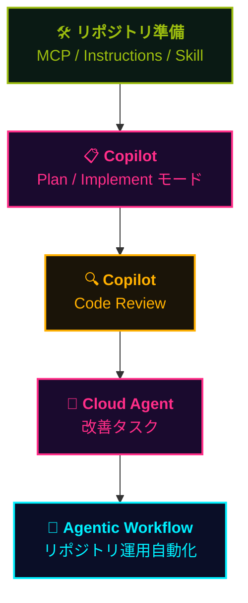

## 一言で

  

    題材は <strong>このプレイブックサイトの簡略版</strong>。あなたが今読んでいるこのサイトを、<strong>Copilot と一緒にゼロから作り直します</strong>。
  

  

    リポジトリを <strong>Codespaces</strong> で開けば、環境構築なしでブラウザからすぐに始められます。
  

> 🪞 **作るもの = 今読んでいるこのサイト(の簡略版)**。だからゴールが分かりやすく、各機能がどの場面で効くかを実感できます。
> 🎮 **使う機能** — MCP / Instructions / Agent Skills / Plan モード / Cloud Agent / Code Review / Agentic Workflow を <strong>一気通貫</strong> で体験。
> 🚀 来週開催の特別ワークショップ向け。Codelabs 形式で 1 ステップずつ進められます。

📘 リポジトリと Codelabs:
- <a class="retro-link" href="https://github.com/theomonfort/Github-copilot-workshop" target="_blank" rel="noopener noreferrer">theomonfort/Github-copilot-workshop ↗</a>
- <a class="retro-link" href="https://theomonfort.github.io/2026-Github-Copilot-Workshop/github-copilot-workshop/custom/handson/" target="_blank" rel="noopener noreferrer">ワークショップ Codelabs を開く ↗</a>

## ワークショップで体験する流れ

**このプレイブックサイトの簡略版** を作りながら、5 つのフェーズで主要機能を一気通貫に体験します。

> 📝 ワークショップ用の **簡略フロー** です。実際の SDLC ではフェーズが行き来したり並列で走ったりします。「どの場面でどの機能を使うか」の感覚を掴むことが目的。

## はじめ方

最短ルート — ブラウザだけで完結:

1. 🌐 リポジトリを開く: <a class="retro-link" href="https://github.com/theomonfort/Github-copilot-workshop" target="_blank" rel="noopener noreferrer">theomonfort/Github-copilot-workshop ↗</a>
2. 🟢 緑の **Code** ボタン → **Codespaces** タブ → **Create codespace on main**
3. 📖 Codelabs を開く: <a class="retro-link" href="https://theomonfort.github.io/2026-Github-Copilot-Workshop/github-copilot-workshop/custom/handson/" target="_blank" rel="noopener noreferrer">ワークショップを開く ↗</a>
4. ⌨️ 1 ステップずつ進めながら Copilot に話しかける

> 💡 ローカルに環境が無くても OK。Codespaces で必要な拡張機能・依存関係はすべて準備済みです。
> 🤖 ワークショップ中に詰まったら、その場で Copilot Chat に質問するのも学びの一部です。
