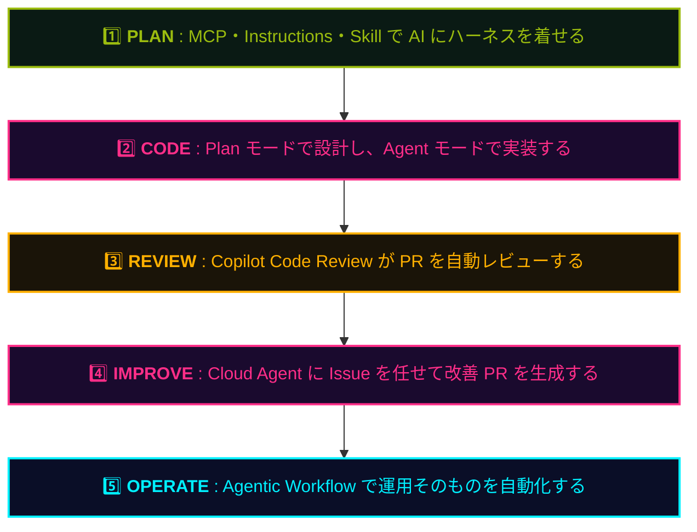

## 一言で

  

    題材は <strong>このプレイブックサイトの簡略版</strong>。今読んでいるこのサイトを、<strong>Copilot と一緒にゼロから作り直します</strong>。
  

  

    リポジトリを <strong>Codespaces</strong> で開けば、環境構築なしでブラウザからすぐに始められます。
  

## 何を作るのか

ハンズオンのゴールは、特別なデモアプリではなく **今見ているこのサイトそのもの**（の簡略版）です。

Playbook で **「なぜ」** を学んだら、ハンズオンで **その知識を実践に落とし込みます** ── 題材は他でもないこのプレイブック自身。読んだ機能をそのまま使って、自分の手で再構築できます。

## ワークショップで体験する流れ

## はじめ方

最短ルート — ブラウザだけで完結:

1. 🌐 リポジトリを開く: <a class="retro-link" href="https://github.com/theomonfort/Github-copilot-workshop" target="_blank" rel="noopener noreferrer">theomonfort/Github-copilot-workshop ↗</a>
2. 🟢 緑の **Code** ボタン → **Codespaces** タブ → **Create codespace on main**
3. 📖 ハンズオンを開く: <a class="retro-link" href="/theomonfort/handson/">ハンズオンを開く →</a>
4. ⌨️ 1 ステップずつ進めながら Copilot に話しかける

> 💡 ローカルに環境が無くても OK。Codespaces で必要な拡張機能・依存関係はすべて準備済みです。
> 🤖 ワークショップ中に詰まったら、その場で Copilot Chat に質問するのも学びの一部です。
