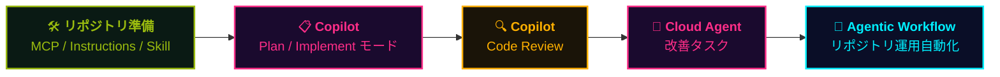

## 一言で

  

    このプレイブックで紹介している概念を、<strong>実際に手を動かして</strong>体験できるワークショップを用意しています。
  

  

    リポジトリを <strong>Codespaces</strong> で開けば、環境構築なしでブラウザからすぐに始められます。
  

> 🎮 **2026 GitHub Copilot Workshop** — このプレイブックで扱う MCP / Instructions / Agent Skills / Plan モード / Cloud Agent / Code Review / Agentic Workflow を、<strong>1 つの簡略化されたプロジェクト</strong>で一気通貫に体験する内容です。
> 🚀 来週開催の特別ワークショップに向けて準備中。Codelabs 形式で 1 ステップずつ進められます。

📘 リポジトリと Codelabs:
- <a class="retro-link" href="https://github.com/theomonfort/2026-Github-Copilot-Workshop" target="_blank" rel="noopener noreferrer">theomonfort/2026-Github-Copilot-Workshop ↗</a>
- <a class="retro-link" href="https://theomonfort.github.io/2026-Github-Copilot-Workshop/github-copilot-workshop" target="_blank" rel="noopener noreferrer">ワークショップ Codelabs を開く ↗</a>

## ワークショップで体験する流れ

このプレイブックの **コア部分を簡略化したシナリオ** を、5 つのフェーズで一気通貫に体験します。

| フェーズ | やること | 関連エントリー |
| --- | --- | --- |
| 🛠️ **準備** | MCP サーバー追加、Instructions ファイル作成、Agent Skill 定義 | <a class="retro-link" href="/theomonfort/playbook/mcp">MCP ↗</a> · <a class="retro-link" href="/theomonfort/playbook/instructions">Instructions ↗</a> · <a class="retro-link" href="/theomonfort/playbook/agent-skills">Agent Skills ↗</a> |
| 📋 **計画 → 実装** | Plan モードで設計 → Implement モードでコード化 | <a class="retro-link" href="/theomonfort/playbook/copilot-chat">Copilot Chat ↗</a> |
| 🔍 **レビュー** | Copilot Code Review で PR を自動レビュー | <a class="retro-link" href="/theomonfort/playbook/copilot-code-review">Code Review ↗</a> |
| 🤖 **改善** | Cloud Agent に改善タスクを委譲・並列実行 | <a class="retro-link" href="/theomonfort/playbook/cloud-agent">Cloud Agent ↗</a> |
| 🔁 **運用** | Agentic Workflow で日次・週次の自動化 | <a class="retro-link" href="/theomonfort/playbook/agentic-workflow">Agentic Workflow ↗</a> |

> 📝 ワークショップ用の **簡略フロー** です。実際の SDLC ではフェーズが行き来したり並列で走ったりします。「どの場面でどの機能を使うか」の感覚を掴むことが目的。

## はじめ方

最短ルート — ブラウザだけで完結:

1. 🌐 リポジトリを開く: <a class="retro-link" href="https://github.com/theomonfort/2026-Github-Copilot-Workshop" target="_blank" rel="noopener noreferrer">theomonfort/2026-Github-Copilot-Workshop ↗</a>
2. 🟢 緑の **Code** ボタン → **Codespaces** タブ → **Create codespace on main**
3. 📖 Codelabs を開く: <a class="retro-link" href="https://theomonfort.github.io/2026-Github-Copilot-Workshop/github-copilot-workshop" target="_blank" rel="noopener noreferrer">ワークショップを開く ↗</a>
4. ⌨️ 1 ステップずつ進めながら Copilot に話しかける

> 💡 ローカルに環境が無くても OK。Codespaces で必要な拡張機能・依存関係はすべて準備済みです。
> 🤖 ワークショップ中に詰まったら、その場で Copilot Chat に質問するのも学びの一部です。
