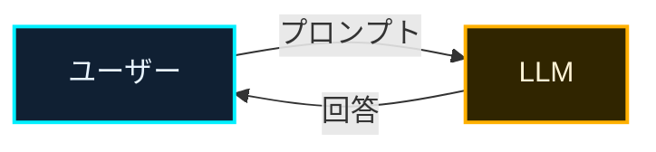
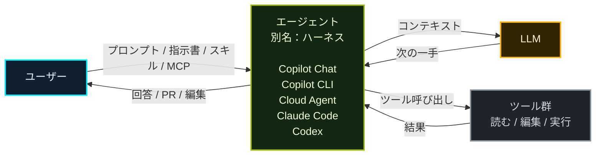
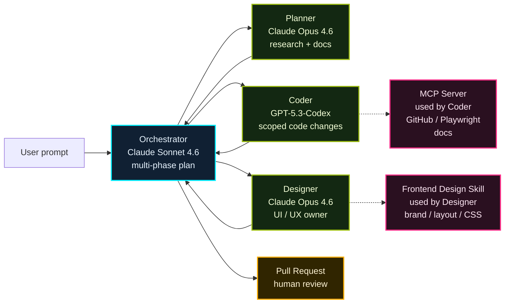

## 一言で

<div class="hero-quote">
  <p>
    <strong>Harness Engineering</strong> は、AI から最高の結果を引き出すための足場設計。
  </p>
  <p>
    ただ制限するだけではなく、目的・文脈・役割・検証方法を整えて、AI が迷わず安全に成果へ向かえる状態を作る。
  </p>
</div>

## 古き良き時代（2021 〜 2024）

昔の LLM chat はシンプルだった。ユーザーがプロンプトを投げ、LLM が回答を返す。



> この世界では、context はほぼ **プロンプトの中に人間が手で詰めるもの** だった。

## 現在（2025 〜）

現在は、**プロジェクトのコンテキスト** と **ツール群** を備えた **エージェント／ハーネス** が LLM の前に立つ。



> 魔法ではない。エージェントは LLM を直接呼ぶ代わりに、**何を読ませるか・どのツールを使わせるか・結果をどう戻すか** を管理するレイヤー。

## Agent / Harness の裏側（簡略版）

- **実行ループ**：LLM が次の一手を決め、tool 実行 → 結果を context に戻す、を `done` まで繰り返す。
- **コンテキスト管理**：system prompt、available tools、user task、tool results を整理し、毎回の LLM call に必要な context として渡す。

```python
# --- Setup ---
system_prompt = "You are a helpful coding assistant..."
available_tools = [search_web, read_file, edit_file, run_terminal]

# --- Agent Loop ---
user_task = input("How can I help you?")
context = [system_prompt, available_tools, user_task]

while True:
    next_step = await llm.determine_next_step(context)
    context.append(next_step)

    if next_step.intent == "done":
        return next_step.final_answer

    result = await execute_tool(next_step.tool, next_step.args)
    context.append(result)
```

## 何でハーネスする？

AI を強くする技術ツールは 1 つではない。**常に読ませるもの** と **必要な時だけ呼ぶもの** を分ける。

| 技術ツール | 置き場所 / 設定 | 使いどころ |
| --- | --- | --- |
| Repository-wide custom instructions | `.github/copilot-instructions.md` | リポジトリ全体の規約・禁止事項・検証コマンド |
| Path-specific custom instructions | `.github/instructions/*.instructions.md` + `applyTo` | `tests/**`、`api/**` など領域別ルール |
| Agent skills | `.github/skills/*/SKILL.md` / `~/.copilot/skills/` | PR description、frontend design など専門手順 |
| Custom agents | `.github/agents/*.agent.md` / `~/.copilot/agents/` | 役割・モデル・使えるツールを切り替える |
| Hooks | `.github/hooks/*.json` | ツール実行前後に script を差し込み、deny / log / notify する |
| MCP servers | MCP 設定ファイル | GitHub、Figma、Playwright、Jira、Salesforce へ接続 |
| Tool permissions | agent host の権限設定 | `read/search` のみ、`edit` 可、コマンド実行可などを制御 |

> GitHub Docs の名称は **Repository-wide custom instructions** と **Path-specific custom instructions**。VS Code 側では後者を **file-based instructions** とも呼ぶ。

## エコシステム対応表

同じ「AI の足場」でも、置き場所やファイル名はエコシステムごとに少し違う。

| Layer | GitHub / Copilot | Open ecosystem |
| --- | --- | --- |
| Global instructions | `.github/copilot-instructions.md` | `AGENTS.md` |
| Path-specific rules | `.github/instructions/*.instructions.md` | nested `AGENTS.md` |
| Skills（project） | `.github/skills/*/SKILL.md` | `.agents/skills/*/SKILL.md` |
| Skills（personal） | `~/.copilot/skills/` | `~/.agents/skills/` |
| Custom agents | Copilot custom agents | agent definitions / plugins |
| MCP / tools | `mcp.config` | `mcp.config` |

> Copilot の強みは、主要ベンダーの形式を native にサポートできること。CLI では `/help` を入力すると、今使える形式やコマンドを確認できる。

## よく使う概念

良い harness はツールの寄せ集めではなく、**AI が迷わない進め方** を先に決める。

| 型 | 何をする？ | 何が良くなる？ |
| --- | --- | --- |
| Spec-to-code / Spec-driven | 先に **what / why** を spec にし、plan → tasks → implement へ落とす | 仕様が source of truth になり、vibe coding ではなく予測可能な実装になる |
| Multi-phase coding plan | orchestrator が実装を複数 phase に分解し、各 phase の目的・順序・完了条件を決める | 大きな変更でも、AI が一気に突っ込まず段階的に進められる |
| File assignment | Planner が触るファイルを明示し、orchestrator が file overlap を見て並列化する | 複数 agent が同じファイルを壊し合わず、Coder / Designer を並列に走らせられる |
| Prompt engineering | Skill / Agent を作る時に **role・objective・deliverable** を明確に書く | 何者として、何を達成し、何を出力すべきかがぶれない |
| Context engineering | タスクに必要な context だけを構造化して渡す | 余計な情報で迷わず、コードベース・仕様・制約に沿った回答になる |
| Approval gates | spec / plan / PR / release など重要な節目で人間が確認する | 自動化の速度を保ちながら、危険な判断だけ人間が止められる |

> 先に **spec・phase・file ownership・role/objective/deliverable・context・approval** を設計すると、AI は速くなるだけでなく、やり直しも減る。

## 例：Ultralight

[Ultralight](https://burkeholland.github.io/ultralight/) は Microsoft の Developer Advocate、Burke Holland さんの multi-agent orchestration 例。  
Multi-phase execution plan を作り、ファイルの重なりを検出し、Planner / Coder / Designer に並列で仕事を渡す harness になっている。



> 🚀 数クリックで試せるように Codespace 対応のリポジトリを用意しました： [theomonfort/ultralight-template](https://github.com/theomonfort/ultralight-template)

## このサイトを作るハーネス

この playbook サイト自体も、同じ考え方のハーネスで作っている。Orchestrator（Theo）が指示書とプロンプトで全体を束ね、フェーズごとに CLI built-in agent・custom agent・skill・MCP を使い分ける。

<div class="harness-map">
  <svg viewBox="0 0 940 566" role="img" aria-label="このサイトを作るハーネスの構成図" xmlns="http://www.w3.org/2000/svg">
    <defs>
      <marker id="hm-arrow" viewBox="0 0 10 10" refX="9" refY="5" markerWidth="7" markerHeight="7" orient="auto-start-reverse">
        <path d="M0,0 L10,5 L0,10 z" fill="#9bbc0f"/>
      </marker>
    </defs>
    <path d="M310,290 H340 V175 H374" fill="none" stroke="#9bbc0f" stroke-width="2.5" marker-end="url(#hm-arrow)"/>
    <path d="M310,290 H374" fill="none" stroke="#9bbc0f" stroke-width="2.5" marker-end="url(#hm-arrow)"/>
    <path d="M499,140 V98" fill="none" stroke="#9bbc0f" stroke-width="2.5" marker-end="url(#hm-arrow)"/>
    <path d="M499,325 V367" fill="none" stroke="#9bbc0f" stroke-width="2.5" marker-end="url(#hm-arrow)"/>
    <path d="M374,303 H356 V520 H374" fill="none" stroke="#9bbc0f" stroke-width="2.5" marker-end="url(#hm-arrow)"/>
    <path d="M624,175 H652 V80 H688" fill="none" stroke="#9bbc0f" stroke-width="2.5" marker-end="url(#hm-arrow)"/>
    <path d="M624,290 H652 V195 H688" fill="none" stroke="#9bbc0f" stroke-width="2.5" marker-end="url(#hm-arrow)"/>
    <path d="M624,290 H688" fill="none" stroke="#9bbc0f" stroke-width="2.5" marker-end="url(#hm-arrow)"/>
    <path d="M624,290 H678 V390 H688" fill="none" stroke="#9bbc0f" stroke-width="2.5" marker-end="url(#hm-arrow)"/>
    <path d="M624,405 H668 V505 H688" fill="none" stroke="#9bbc0f" stroke-width="2.5" marker-end="url(#hm-arrow)"/>
    <rect x="24" y="249" width="290" height="90" rx="2" fill="#05060f"/>
    <rect x="20" y="245" width="290" height="90" rx="2" fill="#0a0e1f" stroke="#00f0ff" stroke-width="2"/>
    <text x="165" y="284" text-anchor="middle" font-family="'DotGothic16', monospace" font-size="19" font-weight="700" fill="#00f0ff">Orchestrator：Theo</text>
    <text x="165" y="306" text-anchor="middle" font-family="'DotGothic16', monospace" font-size="13" fill="#aeb6c2">+ 指示書 / プロンプト</text>
    <rect x="378" y="29" width="250" height="70" rx="2" fill="#05060f"/>
    <rect x="374" y="25" width="250" height="70" rx="2" fill="#0a0e1f" stroke="#8b949e" stroke-width="2"/>
    <text x="499" y="54" text-anchor="middle" font-family="'DotGothic16', monospace" font-size="19" font-weight="700" fill="#d0d7de">Explore / Research</text>
    <text x="499" y="76" text-anchor="middle" font-family="'DotGothic16', monospace" font-size="13" fill="#aeb6c2">CLI Built-in Agents</text>
    <rect x="378" y="144" width="250" height="70" rx="2" fill="#05060f"/>
    <rect x="374" y="140" width="250" height="70" rx="2" fill="#0a0e1f" stroke="#00f0ff" stroke-width="2"/>
    <text x="499" y="169" text-anchor="middle" font-family="'DotGothic16', monospace" font-size="19" font-weight="700" fill="#00f0ff">planner</text>
    <text x="499" y="191" text-anchor="middle" font-family="'DotGothic16', monospace" font-size="13" fill="#aeb6c2">Custom agent</text>
    <text x="616" y="201" text-anchor="end" font-family="'DotGothic16', monospace" font-size="11.5" letter-spacing="1" fill="#9bbc0f">LOCAL</text>
    <rect x="378" y="259" width="250" height="70" rx="2" fill="#05060f"/>
    <rect x="374" y="255" width="250" height="70" rx="2" fill="#0a0e1f" stroke="#8b949e" stroke-width="2"/>
    <text x="499" y="284" text-anchor="middle" font-family="'DotGothic16', monospace" font-size="19" font-weight="700" fill="#d0d7de">Coding</text>
    <text x="499" y="306" text-anchor="middle" font-family="'DotGothic16', monospace" font-size="13" fill="#aeb6c2">CLI Built-in Agents</text>
    <rect x="378" y="374" width="250" height="70" rx="2" fill="#05060f"/>
    <rect x="374" y="370" width="250" height="70" rx="2" fill="#0a0e1f" stroke="#00f0ff" stroke-width="2"/>
    <text x="499" y="399" text-anchor="middle" font-family="'DotGothic16', monospace" font-size="19" font-weight="700" fill="#00f0ff">Tester</text>
    <text x="499" y="421" text-anchor="middle" font-family="'DotGothic16', monospace" font-size="13" fill="#aeb6c2">Custom agent</text>
    <text x="616" y="431" text-anchor="end" font-family="'DotGothic16', monospace" font-size="11.5" letter-spacing="1" fill="#9bbc0f">LOCAL</text>
    <rect x="378" y="489" width="250" height="70" rx="2" fill="#05060f"/>
    <rect x="374" y="485" width="250" height="70" rx="2" fill="#0a0e1f" stroke="#8b949e" stroke-width="2"/>
    <text x="499" y="514" text-anchor="middle" font-family="'DotGothic16', monospace" font-size="19" font-weight="700" fill="#d0d7de">Review</text>
    <text x="499" y="536" text-anchor="middle" font-family="'DotGothic16', monospace" font-size="13" fill="#aeb6c2">CLI Built-in · Rubber Duck</text>
    <rect x="692" y="51" width="240" height="66" rx="2" fill="#05060f"/>
    <rect x="688" y="47" width="240" height="66" rx="2" fill="#0a0e1f" stroke="#ff2e88" stroke-width="2"/>
    <text x="808" y="74" text-anchor="middle" font-family="'DotGothic16', monospace" font-size="19" font-weight="700" fill="#ff2e88">Grill-me</text>
    <text x="808" y="96" text-anchor="middle" font-family="'DotGothic16', monospace" font-size="13" fill="#aeb6c2">Skill</text>
    <text x="920" y="104" text-anchor="end" font-family="'DotGothic16', monospace" font-size="11.5" letter-spacing="1" fill="#9bbc0f">LOCAL</text>
    <rect x="692" y="166" width="240" height="66" rx="2" fill="#05060f"/>
    <rect x="688" y="162" width="240" height="66" rx="2" fill="#0a0e1f" stroke="#9bbc0f" stroke-width="2"/>
    <text x="808" y="201" text-anchor="middle" font-family="'DotGothic16', monospace" font-size="19" font-weight="700" fill="#9bbc0f">MCP Context7</text>
    <text x="920" y="219" text-anchor="end" font-family="'DotGothic16', monospace" font-size="11.5" letter-spacing="1" fill="#9bbc0f">LOCAL</text>
    <rect x="692" y="261" width="240" height="66" rx="2" fill="#05060f"/>
    <rect x="688" y="257" width="240" height="66" rx="2" fill="#0a0e1f" stroke="#ff2e88" stroke-width="2"/>
    <text x="808" y="284" text-anchor="middle" font-family="'DotGothic16', monospace" font-size="19" font-weight="700" fill="#ff2e88">Slide Creator</text>
    <text x="808" y="306" text-anchor="middle" font-family="'DotGothic16', monospace" font-size="13" fill="#aeb6c2">Skill</text>
    <text x="920" y="314" text-anchor="end" font-family="'DotGothic16', monospace" font-size="11.5" letter-spacing="1" fill="#ffb000">REPO</text>
    <rect x="692" y="361" width="240" height="66" rx="2" fill="#05060f"/>
    <rect x="688" y="357" width="240" height="66" rx="2" fill="#0a0e1f" stroke="#ff2e88" stroke-width="2"/>
    <text x="808" y="384" text-anchor="middle" font-family="'DotGothic16', monospace" font-size="19" font-weight="700" fill="#ff2e88">Prototyper</text>
    <text x="808" y="406" text-anchor="middle" font-family="'DotGothic16', monospace" font-size="13" fill="#aeb6c2">Skill</text>
    <text x="920" y="414" text-anchor="end" font-family="'DotGothic16', monospace" font-size="11.5" letter-spacing="1" fill="#ffb000">REPO</text>
    <rect x="692" y="476" width="240" height="66" rx="2" fill="#05060f"/>
    <rect x="688" y="472" width="240" height="66" rx="2" fill="#0a0e1f" stroke="#ff2e88" stroke-width="2"/>
    <text x="808" y="499" text-anchor="middle" font-family="'DotGothic16', monospace" font-size="19" font-weight="700" fill="#ff2e88">Playwright</text>
    <text x="808" y="521" text-anchor="middle" font-family="'DotGothic16', monospace" font-size="13" fill="#aeb6c2">ツール</text>
    <text x="920" y="529" text-anchor="end" font-family="'DotGothic16', monospace" font-size="11.5" letter-spacing="1" fill="#9bbc0f">LOCAL</text>
  </svg>
</div>

> 🟦 Orchestrator / Custom agent ・ ⬜ CLI Built-in ・ 🟩 MCP ・ 🟥 Skill / ツール。`Local` は手元の設定、`Repo` はこのリポジトリ内に置いたもの。
