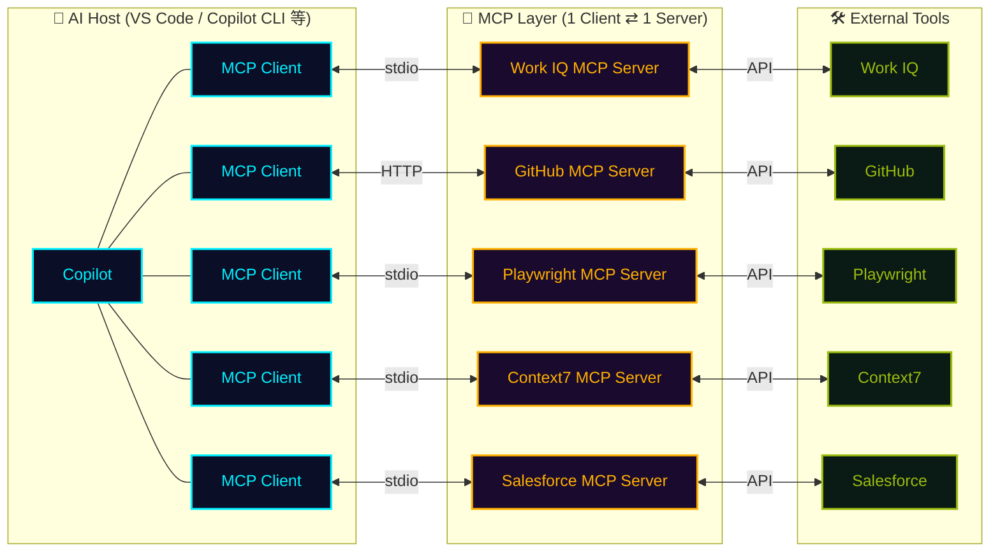

## 一言で

<div class="hero-quote">

MCP は「Model Context Protocol」の略称で、AI モデルに対して追加の文脈や機能を提供するプロトコルである。

</div>

## 仕組み



## なぜ重要?

MCP がもたらす 3 つの価値：

- **🧩 機能拡張**：Copilot を **一つの起点** にして、あらゆる外部ツールを操作できる。
  - 要件を読み書きする (**Jira**)
  - デザインを作る (**Figma**)
  - 3D デザインを生成して印刷する (**Blender** + 3D プリンター)
  - メール・カレンダーを確認・編集する (**Work IQ**)
  - 社内データベースに接続して分析する
- **🔗 ワークフローを統合**：個別ツールを繋ぐカスタム実装が不要になり、Copilot が **複数システムを横断するハブ** として機能する。
- **🌐 広いエコシステム対応**：MCP は **オープンなプロトコル** で、すでに **事実上の標準** になりつつあります。AI アシスタント、**Visual Studio** などの開発ツール、その他多くのアプリケーションが MCP をサポートしており、**一度作れば、どこでも繋がる**。コーディング統合との相性も抜群。

## どこで動く?

<div class="split-image">
  <div class="split-text">

MCP サーバーの実行場所は **2 種類** あります。

1. **stdio 方式** では、VS Code が **ローカルマシン上で子プロセス** として MCP サーバーを起動します。
2. **HTTP 方式（SSE / streamable-http）** では、MCP サーバーが **クラウドやリモートサーバー上で稼働** し、VS Code は **クライアントとして接続するだけ** です。

用途やセキュリティ要件に応じて使い分けが可能です。

  </div>
  <div class="split-figure">
    
    <figcaption>Activity Monitor で見ると、ローカル MCP サーバーが <code>npm exec</code> の <strong>子プロセス</strong> として動いているのが分かる</figcaption>
  </div>
</div>

## VS Code での設定

VS Code の **Marketplace から MCP サーバーをインストール** する時、2 つのスコープを選べる：

- **`Install`** → **個人設定** ファイル（User Settings）に追加
- **`Install Workspace`** → **リポジトリ設定** ファイル（`.vscode/mcp.json`）に追加

<div class="setup-cards">
  <div class="setup-card">
    <div class="setup-card-head">
      <code>.vscode/mcp.json</code>
      <span class="setup-card-tag tag-cyan">▸ リポジトリ共有</span>
    </div>
    <p>Git に含まれるので、<strong>チーム全員</strong> で MCP を揃えられる。メンバーが repo を clone すると VS Code が <strong>「有効化しますか？」</strong> と確認してくる。</p>
  </div>
  <div class="setup-card">
    <div class="setup-card-head">
      <code>User Settings</code>
      <span class="setup-card-tag tag-magenta">▸ 自分の PC のみ</span>
    </div>
    <p><strong>個人用</strong> / 全プロジェクト共通で使いたい時。Git には含まれない。</p>
    <ul class="setup-card-paths">
      <li>📁 <strong>Mac</strong>：<code>~/.config/Code/User/settings.json</code></li>
      <li>🪟 <strong>Windows</strong>：<code>%APPDATA%\Code\User\settings.json</code></li>
    </ul>
  </div>
</div>

## Copilot CLI で始める

```bash
# MCP server を追加
copilot mcp add <server-name>

# 既存サーバ一覧
copilot mcp list
```

GitHub 公式 MCP server は最初から接続済み。`gh` コマンドを叩く感覚で、AI が Issues / PRs / Actions / Code search を操作できる。

`modelcontextprotocol/registry` には公式 + コミュニティ製の server が多数（filesystem / postgres / slack / puppeteer / playwright / Figma…）。

## MCP Registry とは

**MCP Registry** は、エコシステム全体の MCP サーバーを一覧できる **オープンなレジストリ**。自前のレジストリを立てることもできる。

| 項目 | 🌐 MCP Registry | 🐙 GitHub MCP Registry |
| --- | --- | --- |
| 管理者 | **MCP Working Group** | **GitHub** |
| 内容 | 公式 + コミュニティの **全 server**（約 13,238／2026-06-23 時点） | GitHub が **厳選した一覧**（約 100） |
| 既定で使われる場所 | — | <a class="retro-link" href="https://code.visualstudio.com/docs/enterprise/ai-settings#_configure-a-custom-mcp-registry" target="_blank" rel="noopener noreferrer">VS Code ↗</a> など |
| URL | <a class="retro-link" href="https://registry.modelcontextprotocol.io/" target="_blank" rel="noopener noreferrer">registry.modelcontextprotocol.io ↗</a> | <a class="retro-link" href="https://github.com/mcp" target="_blank" rel="noopener noreferrer">github.com/mcp ↗</a> |

> 🛠️ **自前のレジストリ** を作り、許可する server を **拡張** したり **絞り込ん** だりできる。
> 🛡️ 作ったレジストリは **Organization / Enterprise レベルで強制** できる（allowlist enforcement）。

## 自前の MCP Registry を作る

ホスティングは **2 通り**。どちらも VS Code / Org / Enterprise から参照・強制できる（⚠️ 要注意: 強制が効くのはユーザーが実際に**利用中（アクティブ）のライセンス**に対してのみ）。

<div class="setup-cards">
  <div class="setup-card">
    <div class="setup-card-head">
      <code>Self-hosted</code>
      <span class="setup-card-tag tag-cyan">▸ フルコントロール</span>
    </div>
    <p>OSS の <a class="retro-link" href="https://github.com/modelcontextprotocol/registry" target="_blank" rel="noopener noreferrer">modelcontextprotocol/registry ↗</a>（Go 製サービス）を自前のインフラにデプロイ。MCP Working Group が公式メンテ。</p>
  </div>
  <div class="setup-card">
    <div class="setup-card-head">
      <code>Azure API Center</code>
      <span class="setup-card-tag tag-magenta">▸ マネージド</span>
    </div>
    <p>Azure の <a class="retro-link" href="https://learn.microsoft.com/en-us/azure/api-center/register-discover-mcp-server" target="_blank" rel="noopener noreferrer">API Center ↗</a> に MCP server を登録・公開。インフラ管理は不要。</p>
  </div>
</div>

### クライアント側の設定

- **GitHub Org / Enterprise**：<a class="retro-link" href="https://docs.github.com/en/copilot/how-tos/administer-copilot/manage-mcp-usage/configure-mcp-registry" target="_blank" rel="noopener noreferrer">レジストリを設定 ↗</a> し、<a class="retro-link" href="https://docs.github.com/en/copilot/reference/mcp-allowlist-enforcement" target="_blank" rel="noopener noreferrer">allowlist で強制 ↗</a>

> 🔒 **公開とアクセスは別物：** Azure API Center に登録した server は、カタログに到達できる人には **誰でも見える**。ただし公開されるのは **メタデータだけ**。実際の **ダウンロード／接続は別で制御** できる — 社内向けの自前 server なら、stdio server は **プライベートなパッケージレジストリ**（GitHub Packages / GHCR / Azure Artifacts など）に公開し、HTTP server は **社内ネットワーク / VPN 内**に置けば、認証済みの社員だけが取得・接続できる。

## MCP Registry をローカルで試す

> 🧪 **これは手順書ではなく個人メモ。** 私が実際に試して動いた流れを AI がまとめたもの。ざっくりイメージを掴むためのもので、環境により変わる。

ローカルに registry を立て、HTTPS で公開し、自分の Org に接続して GitHub MCP Registry から seed するまでの流れ。

1. **Fork & clone** — `gh repo fork modelcontextprotocol/registry --clone`
2. **Docker で起動** — `docker compose up` → API は `localhost:8080`（初期 DB は demo seed のみ）
3. **HTTPS トンネル** — `cloudflared tunnel --url http://localhost:8080` → `https://<random>.trycloudflare.com`
4. **接続** — トンネル URL を **MCP Registry URL** に設定（`/v0.1/servers` は付けない。Copilot が自動付与）。**Org** は Settings → Copilot → **Policies** → MCP、**Enterprise** は **AI controls** → MCP
5. **VS Code をリロード & 確認** — Developer: Reload Window → `@mcp` で自分の registry の server だけが表示される。`Cmd + ,`（設定）で MCP 設定が **「managed by your organization」** バッジ付き（＝ Org ポリシーが効いている）か確認
6. **GitHub Registry から seed** — `go run scripts/mirror_data/fetch_production_data.go` + `load_production_data.go`（source: `https://api.mcp.github.com/v0.1/servers`）

> ⚠️ VS Code が **この Org の Copilot ライセンス** を使っているか確認（別アカウント/個人プランだと Org のポリシーが効かない）。`mirror_data` スクリプトは as-is なので、許可したい server に合わせて絞り込む。
