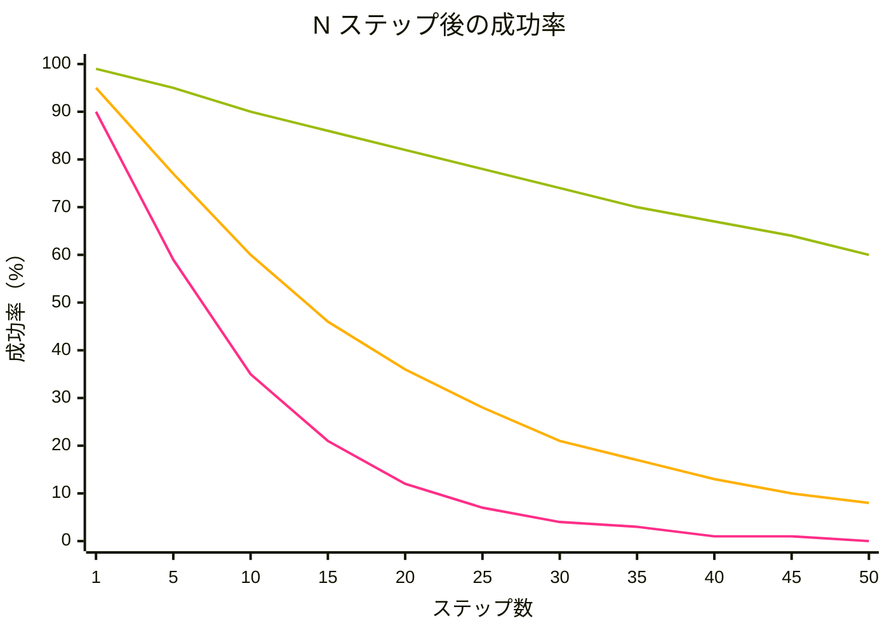

## 一言で

  

    AI のコストは上がり続けています ── 1 トークンが高くなったのではなく、エージェントが <strong>多くのステップ</strong> をこなすようになったから。主なレバーは 2 つ ── <strong>質の高いエージェント</strong> と <strong>タスクに合ったエージェント選び</strong>。
  

## Agent ROI

<figure class="agent-roi-formula" style="margin: 2.5em 0;">
<svg viewBox="0 0 1720 460" width="100%" xmlns="http://www.w3.org/2000/svg" role="img" aria-label="Agent ROI = (Agent 出力の価値 − トークンコスト) / トークンコスト × 100%。価値を伸ばせば、結果としてコストは下がる。" style="display:block;max-width:1100px;margin:0 auto;">
<defs>
<linearGradient id="roi-funnel" x1="0" y1="0" x2="0" y2="1">
<stop offset="0%" stop-color="#9bbc0f" stop-opacity="0.55"/>
<stop offset="100%" stop-color="#9bbc0f" stop-opacity="0"/>
</linearGradient>
</defs>
<text x="20" y="340" font-size="60" font-weight="bold" fill="#9bbc0f" font-family="'JetBrains Mono','Courier New',monospace" letter-spacing="3">AGENT ROI</text>
<circle cx="475" cy="320" r="34" fill="none" stroke="#9bbc0f" stroke-width="2"/>
<text x="475" y="338" text-anchor="middle" font-size="44" fill="#ffffff" font-family="serif">=</text>
<rect x="555" y="20" width="350" height="80" fill="rgba(5,6,15,0.85)" stroke="#9bbc0f" stroke-width="2"/>
<text x="730" y="50" text-anchor="middle" font-size="22" fill="#9bbc0f" font-family="'JetBrains Mono','Noto Sans JP',monospace" font-weight="bold">ここを</text>
<text x="730" y="82" text-anchor="middle" font-size="22" fill="#9bbc0f" font-family="'JetBrains Mono','Noto Sans JP',monospace" font-weight="bold">伸ばすほど…</text>
<polygon points="555,100 905,100 810,225 650,225" fill="url(#roi-funnel)"/>
<text x="730" y="265" text-anchor="middle" font-size="46" fill="#ffffff" font-family="'Noto Sans JP',sans-serif">Agent 出力の価値</text>
<circle cx="1080" cy="248" r="30" fill="none" stroke="#9bbc0f" stroke-width="2"/>
<text x="1080" y="265" text-anchor="middle" font-size="40" fill="#ffffff" font-family="serif">−</text>
<rect x="1060" y="20" width="420" height="80" fill="rgba(5,6,15,0.85)" stroke="#9bbc0f" stroke-width="2"/>
<text x="1270" y="50" text-anchor="middle" font-size="22" fill="#9bbc0f" font-family="'JetBrains Mono','Noto Sans JP',monospace" font-weight="bold">…たいてい</text>
<text x="1270" y="82" text-anchor="middle" font-size="22" fill="#9bbc0f" font-family="'JetBrains Mono','Noto Sans JP',monospace" font-weight="bold">こちらは下がる</text>
<polygon points="1060,100 1480,100 1370,225 1200,225" fill="url(#roi-funnel)"/>
<text x="1270" y="265" text-anchor="middle" font-size="46" fill="#ffffff" font-family="'Noto Sans JP',sans-serif">トークンコスト</text>
<line x1="585" y1="320" x2="1480" y2="320" stroke="#ffffff" stroke-width="3"/>
<text x="1032" y="395" text-anchor="middle" font-size="46" fill="#ffffff" font-family="'Noto Sans JP',sans-serif">トークンコスト</text>
<circle cx="1525" cy="320" r="30" fill="none" stroke="#9bbc0f" stroke-width="2"/>
<text x="1525" y="340" text-anchor="middle" font-size="40" fill="#ffffff" font-family="serif">*</text>
<text x="1570" y="338" font-size="46" fill="#ffffff" font-family="'Noto Sans JP',sans-serif">100%</text>
</svg>
</figure>

> 🚀 *NASA が 20 発のロケットを月にだいたい向けて打ち、1 発でも当たれと祈る ── 今のエージェント運用は割とこれ。トークンが安かった時代はギャンブルでよかった。今は違う。*

## 複利でエラーが効いてくる（Compound Error Problem）

LLM は非決定的です。1 ステップの小さな誤差率は、対処しないと **複利で効いてきます**。最速のトークン削減策は、**小さなミスを早めに見つけて、「リトライを起こさせない」** ことです。

<strong>99%</strong> 1 ステップ精度 &nbsp;·&nbsp; <strong>95%</strong> 1 ステップ精度 &nbsp;·&nbsp; <strong>90%</strong> 1 ステップ精度

> 🔢 **目安**：**10 ステップ後** → 90% / 60% / 35%、**50 ステップ後** → **60% / 8% / 0.5%**。90% ラインは 30 ステップ前後で実質壊死。

## Advice 1 — context は「必要最小限」を渡す…

<a class="retro-link" href="/theomonfort/playbook/context-engineering">Context Engineering ↗</a> で見たとおり、context window はターンごとに膨らみ、詰め込みすぎると **context rot（コンテキスト劣化）** で agent はむしろ鈍くなります。

- **`copilot-instructions` は短く** ── 本当に「毎回」効くルールだけ残す
- **skill を増やしすぎない** ── React・TypeScript・Tailwind などは学習データで十分
- **skill の中身も短く** ── 「Caveman skill」は本文 1 行（`Be concise`）で置き換えられる
- **path-instruction をフォルダ全体に撒かない** ── そのフォルダでの呼び出しで毎回静かに読み込まれる
- **「念のため」のファイル先読みをしない** ── 必要になったら agent に取りに行かせる

## Advice 2 — …でも、必要な情報は省かない

レバーの反対側です。context が **不足** すると、agent は **仮定** で穴を埋めます。その仮定が、先ほどのグラフの「失敗ループ」になります。

- **目的・制約・「完了」の定義を明示する** ── 曖昧な依頼は、agent が意図を推測しながらリトライを繰り返すぶん、饒舌な依頼より高くつく
- **正しいファイルを指定する** ── リポジトリ全体を闇雲に grep させない
- **自明でない規約は前置きする** ── 命名・エラー型・公開 API・セキュリティ境界など
- **触ってほしくない場所も伝える** ── 後の「誤ファイル修正 → ロールバック」リトライを防げる
- **エラーやログ行はそのまま貼る** ── ツール呼び出しを 1〜3 回節約できる

## Advice 3 — プロンプトエンジニアリング

✓ ルール 01

明確に

目的・制約・「完了」の条件まで書く。

✓ ルール 02

停止条件を入れる

「X なら止まれ」で探索の暴走を防ぐ。

✓ ルール 03

事前にコンテキストを渡す

ファイル・フォルダ・URL・エラーログ ── agent に探させないで済むものは全部。

> 💡 **プロンプトは常時オン** ── 一度送ると、以降のターンすべてで system + tools と一緒に課金されます。だからこそ、丁寧に書く価値があります。

## Advice 4 — Research → Plan → Implement

**タスクを分割統治する。** 調査・計画・実装を **1 セッション** でまとめてやらないでください。コンテキストが汚染され、エージェントが迷子になります。3 つの順次エージェントに分け、それぞれに必要最小限のコンテキストだけを渡します。

<figure class="rpi-pipeline" style="margin:2em 0;">
<svg viewBox="0 130 1100 475" xmlns="http://www.w3.org/2000/svg" style="width:100%;height:auto;display:block;font-family:'DotGothic16','Courier New',monospace;">
<rect x="155" y="150" width="320" height="68" rx="10" fill="#0a0e27" stroke="#ff2e88" stroke-width="2"/>
<text x="175" y="180" fill="#e8f4ff" font-size="13" font-weight="bold">“I WANT TO CHANGE X.</text>
<text x="175" y="202" fill="#e8f4ff" font-size="13" font-weight="bold">WHAT FILES ARE RELEVANT?”</text>
<line x1="315" y1="218" x2="315" y2="263" stroke="#ff2e88" stroke-width="2"/>
<circle cx="315" cy="263" r="5" fill="#ff2e88"/>
<text x="20" y="292" fill="#e8f4ff" font-size="14" font-weight="bold">/RESEARCH</text>
<text x="20" y="310" fill="#9bbc0f" font-size="11" letter-spacing="1">GEMINI 2.5 PRO</text>
<rect x="155" y="265" width="110" height="55" rx="12" fill="#9bbc0f"/>
<text x="210" y="290" fill="#05060f" font-size="11" font-weight="bold" text-anchor="middle">SYSTEM</text>
<text x="210" y="306" fill="#05060f" font-size="11" font-weight="bold" text-anchor="middle">PROMPT</text>
<rect x="270" y="265" width="90" height="55" rx="12" fill="#ff2e88"/>
<text x="315" y="298" fill="#e8f4ff" font-size="11" font-weight="bold" text-anchor="middle">PROMPT</text>
<rect x="365" y="265" width="78" height="55" rx="12" fill="#ffb000"/>
<text x="404" y="298" fill="#05060f" font-size="11" font-weight="bold" text-anchor="middle">FILE</text>
<circle cx="435" cy="270" r="10" fill="#05060f" stroke="#ff2e88" stroke-width="2"/>
<text x="435" y="274" fill="#ff2e88" font-size="12" font-weight="bold" text-anchor="middle">✗</text>
<rect x="448" y="265" width="78" height="55" rx="12" fill="#ffb000"/>
<text x="487" y="298" fill="#05060f" font-size="11" font-weight="bold" text-anchor="middle">FILE</text>
<circle cx="518" cy="270" r="10" fill="#05060f" stroke="#ff2e88" stroke-width="2"/>
<text x="518" y="274" fill="#ff2e88" font-size="12" font-weight="bold" text-anchor="middle">✗</text>
<rect x="531" y="265" width="78" height="55" rx="12" fill="#ffb000"/>
<text x="570" y="298" fill="#05060f" font-size="11" font-weight="bold" text-anchor="middle">FILE</text>
<circle cx="601" cy="270" r="10" fill="#05060f" stroke="#9bbc0f" stroke-width="2"/>
<text x="601" y="274" fill="#9bbc0f" font-size="12" font-weight="bold" text-anchor="middle">✓</text>
<rect x="614" y="265" width="78" height="55" rx="12" fill="#ffb000"/>
<text x="653" y="298" fill="#05060f" font-size="11" font-weight="bold" text-anchor="middle">FILE</text>
<circle cx="684" cy="270" r="10" fill="#05060f" stroke="#ff2e88" stroke-width="2"/>
<text x="684" y="274" fill="#ff2e88" font-size="12" font-weight="bold" text-anchor="middle">✗</text>
<rect x="697" y="265" width="78" height="55" rx="12" fill="#ffb000"/>
<text x="736" y="298" fill="#05060f" font-size="11" font-weight="bold" text-anchor="middle">FILE</text>
<circle cx="767" cy="270" r="10" fill="#05060f" stroke="#ff2e88" stroke-width="2"/>
<text x="767" y="274" fill="#ff2e88" font-size="12" font-weight="bold" text-anchor="middle">✗</text>
<rect x="780" y="265" width="78" height="55" rx="12" fill="#ffb000"/>
<text x="819" y="298" fill="#05060f" font-size="11" font-weight="bold" text-anchor="middle">FILE</text>
<circle cx="850" cy="270" r="10" fill="#05060f" stroke="#9bbc0f" stroke-width="2"/>
<text x="850" y="274" fill="#9bbc0f" font-size="12" font-weight="bold" text-anchor="middle">✓</text>
<rect x="863" y="265" width="110" height="55" rx="12" fill="#00f0ff"/>
<text x="918" y="290" fill="#05060f" font-size="11" font-weight="bold" text-anchor="middle">PLAN</text>
<text x="918" y="306" fill="#05060f" font-size="11" font-weight="bold" text-anchor="middle">INPUT</text>
<path d="M 945 320 L 945 365 L 425 365 L 425 393" fill="none" stroke="#00f0ff" stroke-width="2"/>
<circle cx="425" cy="394" r="5" fill="#00f0ff"/>
<text x="20" y="422" fill="#e8f4ff" font-size="14" font-weight="bold">/PLAN</text>
<text x="20" y="440" fill="#9bbc0f" font-size="11" letter-spacing="1">OPUS 4.7</text>
<rect x="155" y="395" width="110" height="55" rx="12" fill="#9bbc0f"/>
<text x="210" y="420" fill="#05060f" font-size="11" font-weight="bold" text-anchor="middle">SYSTEM</text>
<text x="210" y="436" fill="#05060f" font-size="11" font-weight="bold" text-anchor="middle">PROMPT</text>
<rect x="270" y="395" width="90" height="55" rx="12" fill="#ff2e88"/>
<text x="315" y="428" fill="#e8f4ff" font-size="11" font-weight="bold" text-anchor="middle">PROMPT</text>
<rect x="370" y="395" width="110" height="55" rx="12" fill="#00f0ff"/>
<text x="425" y="420" fill="#05060f" font-size="11" font-weight="bold" text-anchor="middle">PLAN</text>
<text x="425" y="436" fill="#05060f" font-size="11" font-weight="bold" text-anchor="middle">INPUT</text>
<rect x="485" y="395" width="78" height="55" rx="12" fill="#ffb000"/>
<text x="524" y="428" fill="#05060f" font-size="11" font-weight="bold" text-anchor="middle">FILE</text>
<rect x="568" y="395" width="78" height="55" rx="12" fill="#ffb000"/>
<text x="607" y="428" fill="#05060f" font-size="11" font-weight="bold" text-anchor="middle">FILE</text>
<rect x="651" y="395" width="130" height="55" rx="12" fill="rgba(232,244,255,0.08)" stroke="rgba(232,244,255,0.35)" stroke-width="1"/>
<text x="716" y="428" fill="#e8f4ff" font-size="11" font-weight="bold" text-anchor="middle">REASONING</text>
<rect x="786" y="395" width="120" height="55" rx="12" fill="#00f0ff"/>
<text x="846" y="420" fill="#05060f" font-size="11" font-weight="bold" text-anchor="middle">PRECISE</text>
<text x="846" y="436" fill="#05060f" font-size="11" font-weight="bold" text-anchor="middle">SPEC</text>
<path d="M 875 450 L 875 495 L 430 495 L 430 523" fill="none" stroke="#00f0ff" stroke-width="2"/>
<circle cx="430" cy="524" r="5" fill="#00f0ff"/>
<text x="20" y="552" fill="#e8f4ff" font-size="14" font-weight="bold">/FLEET</text>
<text x="20" y="570" fill="#9bbc0f" font-size="11" letter-spacing="1">GPT 5.4</text>
<rect x="155" y="525" width="110" height="55" rx="12" fill="#9bbc0f"/>
<text x="210" y="550" fill="#05060f" font-size="11" font-weight="bold" text-anchor="middle">SYSTEM</text>
<text x="210" y="566" fill="#05060f" font-size="11" font-weight="bold" text-anchor="middle">PROMPT</text>
<rect x="270" y="525" width="90" height="55" rx="12" fill="#ff2e88"/>
<text x="315" y="558" fill="#e8f4ff" font-size="11" font-weight="bold" text-anchor="middle">PROMPT</text>
<rect x="370" y="525" width="120" height="55" rx="12" fill="#00f0ff"/>
<text x="430" y="550" fill="#05060f" font-size="11" font-weight="bold" text-anchor="middle">PRECISE</text>
<text x="430" y="566" fill="#05060f" font-size="11" font-weight="bold" text-anchor="middle">SPEC</text>
<rect x="495" y="525" width="78" height="55" rx="12" fill="#ffb000"/>
<text x="534" y="558" fill="#05060f" font-size="11" font-weight="bold" text-anchor="middle">FILE</text>
<rect x="578" y="525" width="78" height="55" rx="12" fill="#ffb000"/>
<text x="617" y="558" fill="#05060f" font-size="11" font-weight="bold" text-anchor="middle">FILE</text>
<rect x="661" y="525" width="200" height="55" rx="12" fill="#00f0ff"/>
<text x="761" y="558" fill="#05060f" font-size="11" font-weight="bold" text-anchor="middle">CHANGE CALLS</text>
</svg>
</figure>

> 💡 <a class="retro-link" href="/theomonfort/playbook/cli">Copilot CLI ↗</a> の `/research`・`/plan`・`/fleet` がこの 3 フェーズに対応しています。各フェーズは別のコンテキストウィンドウで走るので、肥大化した Research セッションが Implementer に届きません。

## Advice 5 — 決定的なコントロール

テスト・リンター・型チェック・セキュリティスキャンは「人間のためのチェック」だけではありません ── 1 回のバグ修正が 4 段重ねの劣化スパイラルになるのを止める **トークン節約のガードレール** です。あれば **入った同じループでエラーが捕まり**、無ければ CI 時間・Copilot レビュー往復・人間のトリアージ時間で支払う羽目になります。

<figure class="rpi-pipeline" style="margin:2em 0;">
<svg viewBox="0 140 1000 370" xmlns="http://www.w3.org/2000/svg" style="width:100%;height:auto;display:block;font-family:'DotGothic16','Courier New',monospace;">
<text x="20" y="183" fill="#e8f4ff" font-size="13" font-weight="bold">WITH</text>
<text x="20" y="200" fill="#e8f4ff" font-size="13" font-weight="bold">UNIT TESTS</text>
<rect x="160" y="160" width="95" height="55" rx="12" fill="#9bbc0f"/>
<text x="207" y="185" fill="#05060f" font-size="11" font-weight="bold" text-anchor="middle">SYSTEM</text>
<text x="207" y="201" fill="#05060f" font-size="11" font-weight="bold" text-anchor="middle">&amp; TOOLS</text>
<rect x="263" y="160" width="95" height="55" rx="12" fill="#ff2e88"/>
<text x="310" y="193" fill="#e8f4ff" font-size="11" font-weight="bold" text-anchor="middle">PROMPT</text>
<rect x="366" y="160" width="95" height="55" rx="12" fill="#dc2626"/>
<text x="413" y="185" fill="#e8f4ff" font-size="11" font-weight="bold" text-anchor="middle">BUGGY</text>
<text x="413" y="201" fill="#e8f4ff" font-size="11" font-weight="bold" text-anchor="middle">CHANGE</text>
<rect x="469" y="160" width="95" height="55" rx="12" fill="#dc2626"/>
<text x="516" y="185" fill="#e8f4ff" font-size="11" font-weight="bold" text-anchor="middle">FAILING</text>
<text x="516" y="201" fill="#e8f4ff" font-size="11" font-weight="bold" text-anchor="middle">TESTS</text>
<rect x="572" y="160" width="120" height="55" rx="12" fill="#9bbc0f"/>
<text x="632" y="185" fill="#05060f" font-size="11" font-weight="bold" text-anchor="middle">CORRECTION</text>
<text x="632" y="201" fill="#05060f" font-size="11" font-weight="bold" text-anchor="middle">CHANGE</text>
<rect x="700" y="160" width="95" height="55" rx="12" fill="#9bbc0f"/>
<text x="747" y="185" fill="#05060f" font-size="11" font-weight="bold" text-anchor="middle">CHANGE</text>
<text x="747" y="201" fill="#05060f" font-size="11" font-weight="bold" text-anchor="middle">2</text>
<rect x="803" y="160" width="130" height="55" rx="12" fill="#9bbc0f"/>
<text x="868" y="185" fill="#05060f" font-size="11" font-weight="bold" text-anchor="middle">SUCCEEDING</text>
<text x="868" y="201" fill="#05060f" font-size="11" font-weight="bold" text-anchor="middle">TESTS</text>
<text x="20" y="298" fill="#e8f4ff" font-size="13" font-weight="bold">WITHOUT</text>
<text x="20" y="315" fill="#e8f4ff" font-size="13" font-weight="bold">UNIT TESTS</text>
<rect x="160" y="275" width="95" height="55" rx="12" fill="#9bbc0f"/>
<text x="207" y="300" fill="#05060f" font-size="11" font-weight="bold" text-anchor="middle">SYSTEM</text>
<text x="207" y="316" fill="#05060f" font-size="11" font-weight="bold" text-anchor="middle">&amp; TOOLS</text>
<rect x="263" y="275" width="95" height="55" rx="12" fill="#ff2e88"/>
<text x="310" y="308" fill="#e8f4ff" font-size="11" font-weight="bold" text-anchor="middle">PROMPT</text>
<rect x="366" y="275" width="95" height="55" rx="12" fill="#dc2626"/>
<text x="413" y="300" fill="#e8f4ff" font-size="11" font-weight="bold" text-anchor="middle">BUGGY</text>
<text x="413" y="316" fill="#e8f4ff" font-size="11" font-weight="bold" text-anchor="middle">CHANGE</text>
<rect x="469" y="275" width="110" height="55" rx="12" fill="#dc2626"/>
<text x="524" y="300" fill="#e8f4ff" font-size="11" font-weight="bold" text-anchor="middle">BUGGY</text>
<text x="524" y="316" fill="#e8f4ff" font-size="11" font-weight="bold" text-anchor="middle">CHANGE 2</text>
<rect x="587" y="275" width="110" height="55" rx="12" fill="#dc2626"/>
<text x="642" y="300" fill="#e8f4ff" font-size="11" font-weight="bold" text-anchor="middle">BUGGY</text>
<text x="642" y="316" fill="#e8f4ff" font-size="11" font-weight="bold" text-anchor="middle">CHANGE 3</text>
<rect x="705" y="275" width="110" height="55" rx="12" fill="#dc2626"/>
<text x="760" y="300" fill="#e8f4ff" font-size="11" font-weight="bold" text-anchor="middle">BUGGY</text>
<text x="760" y="316" fill="#e8f4ff" font-size="11" font-weight="bold" text-anchor="middle">CHANGE 4</text>
<line x1="10" y1="335" x2="10" y2="365" stroke="#9bbc0f" stroke-width="2"/>
<polygon points="6,360 14,360 10,370" fill="#9bbc0f"/>
<text x="20" y="370" fill="#e8f4ff" font-size="13" font-weight="bold">INCIDENT</text>
<circle cx="160" cy="365" r="5" fill="#ff2e88"/>
<line x1="165" y1="365" x2="220" y2="365" stroke="#ff2e88" stroke-width="2"/>
<text x="228" y="354" fill="#e8f4ff" font-size="11" font-weight="bold">WASTED CI/CD MINUTES,</text>
<text x="228" y="370" fill="#e8f4ff" font-size="11" font-weight="bold">COPILOT REVIEW CYCLES,</text>
<text x="228" y="386" fill="#e8f4ff" font-size="11" font-weight="bold">HUMAN TIME ETC.</text>
<line x1="10" y1="395" x2="10" y2="415" stroke="#9bbc0f" stroke-width="2"/>
<polygon points="6,410 14,410 10,420" fill="#9bbc0f"/>
<text x="20" y="438" fill="#e8f4ff" font-size="13" font-weight="bold">DEBUGGING</text>
<text x="20" y="455" fill="#e8f4ff" font-size="13" font-weight="bold">SESSION</text>
<rect x="160" y="420" width="95" height="55" rx="12" fill="#9bbc0f"/>
<text x="207" y="445" fill="#05060f" font-size="11" font-weight="bold" text-anchor="middle">SYSTEM</text>
<text x="207" y="461" fill="#05060f" font-size="11" font-weight="bold" text-anchor="middle">&amp; TOOLS</text>
<rect x="263" y="420" width="95" height="55" rx="12" fill="#ff2e88"/>
<text x="310" y="453" fill="#e8f4ff" font-size="11" font-weight="bold" text-anchor="middle">PROMPT</text>
<rect x="366" y="420" width="180" height="55" rx="12" fill="#dc2626"/>
<text x="456" y="453" fill="#e8f4ff" font-size="11" font-weight="bold" text-anchor="middle">BUGGY RESEARCH</text>
<rect x="554" y="420" width="110" height="55" rx="12" fill="#9bbc0f"/>
<text x="609" y="453" fill="#05060f" font-size="11" font-weight="bold" text-anchor="middle">BUG FIX</text>
</svg>
</figure>

> 📊 **証拠**: Copilot CLI チームのコードベースは **半分以上がテスト** で構成されています。

## Advice 6 — モデル選びと Auto モード

ティア選びを間違えると、同じタスクでも **約 24 倍のコスト差** が出ます。typo 修正に Reasoning モデルを使ってしまうのが一番ありがちなムダです。意図的に選ぶ ── または Auto に任せましょう。

| ティア | モデル | 用途 |
| --- | --- | --- |
| 🤖 **Auto モード** | _ものぐさのデフォルト_ | **タスクの意図** に応じてモデルを自動選択 ── プレミアムリクエストに **10% の割引** （<a class="retro-link" href="https://github.blog/changelog/2026-05-20-auto-model-selection-now-routes-based-on-your-task-in-vs-code/" target="_blank" rel="noopener">2026 年 5 月の Changelog ↗</a>） |
| 🧠 **Reasoning** | `Opus 4.7` · `GPT-5.5` | 同期の設計・アーキテクチャ・デバッグ・難しいレビュー。⚠️ 実装には使わない ── 仕様を再考しがち |
| ⚡ **Mid-tier** | `Sonnet` · `GPT-5.4` | 非同期の実装。Cloud Agent タスクの大半はここ |
| 🪶 **Low-tier** | `Haiku` · `GPT-mini` | 小さなリファクタ、繰り返し作業、ドキュメント更新 |

## Advice 7 — トークナイズは言語中立ではない

同じ意味の文でも、日本語は英語の **約 2〜3 倍のトークン** を消費します。`copilot-instructions.md`・Skill の description・MCP のツール定義・コードコメントなど **常時オン** のテキストでは、この差が **毎ループに課税** されます。

🇬🇧 ENGLISH

Always run tests before committing changes

Always·run·tests·before·committing·changes

= 6 トークン

🇯🇵 JAPANESE

変更をコミットする前に必ずテストを実行して

変更をコミットする前に必ずテストを実行して

= 15 トークン（約 2.5 倍）

トークン数は OpenAI の <code>o200k_base</code>（<strong>GPT-5.x・GPT-4o・o1・o3</strong> が使用するトークナイザ）で計測。旧 <code>cl100k_base</code>（GPT-4 / GPT-3.5）では日本語側が 22 トークン（約 3.7 倍）でした。

> 🔬 **自分で確認:** <a class="retro-link" href="https://tiktokenizer.vercel.app/" target="_blank" rel="noopener">tiktokenizer.vercel.app ↗</a> や <a class="retro-link" href="https://platform.openai.com/tokenizer" target="_blank" rel="noopener">platform.openai.com/tokenizer ↗</a> に同じ指示文を英日で貼り付け、トークン数を見比べてください。

## Advice 8 — エージェントが読める形式で知識を保存する

`.xlsx` / `.docx` / `.pdf` を渡すたびに、エージェントは「パーサを書く → 実行 → 散らかった出力を読み戻す」という **3 ステップの迂回路** に入ります。パース後のテキストは同じ情報の Markdown 版より **3〜10 倍長い** ── レイアウト情報がノイズとして混ざるからです。

ナレッジ・仕様書・参照テーブルは **Markdown / CSV / プレーンテキスト** で保存しましょう。

| 元のフォーマット | 推奨される変換先 |
| --- | --- |
| 📊 `.xlsx` / Google Sheets | **CSV** または Markdown テーブル |
| 📝 `.docx` / `.pptx` | **`.md`** |
| 📄 `.pdf` | **`.md` / `.txt`**（`pandoc`・`pdftotext`） |
| 🌐 Web ページ | **Markdown 抽出**（例: `r.jina.ai/<url>`） |
| 🖼️ テキストの画像 | **OCR → Markdown** |

## 上級者向け — パワーユーザーのヒント

ここから先は条件付き＆トレードオフあり。上の基本を入れ終えてから手を出す。

- 🧮 **コードで考える** — 巨大な API レスポンスや長いファイルは、まずスクリプトでフィルタしてからエージェントに渡す。
- 🖥️ **CLI vs MCP** — `gh` / `kubectl` / `npm` などの CLI に頼る方が、同等の MCP より軽いことが多い（モデルが既に知っているから）。
- ✂️ **シェル出力をトリム** — <a href="https://github.com/rtk-ai/rtk" target="_blank" rel="noopener noreferrer" class="retro-link">rtk-ai/rtk</a> のようなツールは、よく使う開発コマンドで LLM のトークン消費を **60〜90% 削減** します。
- 📊 **`/chronicle tip` を定期的に** — Copilot CLI のセッションを分析し、改善点を具体的に教えてくれる。
- 🔁 **ツール呼び出しをまとめる** — <a href="https://github.com/jsturtevant/copilot-codeact-plugin" target="_blank" rel="noopener noreferrer" class="retro-link">copilot-codeact-plugin</a> は複数のツール呼び出しを 1 ラウンドトリップに畳む。
- 🎚️ **モデル別の細かいチューニング** — 可能だがモデルの進化が速いので、超大規模運用のみ価値あり。

## 長期的なマインドセット

- 🧭 **分析力を磨く。** 開発者の真の価値はコーディングではなく分析力とドメインへの素早い習熟だった。**ドメインの言葉でエージェントに正確に指示できる** ことが最も価値のあるスキルになる。
- 🏛️ **良いアーキテクチャを適用する。** DDD・ヘキサゴナル・CQRS・Event-Driven ── 境界が明確だとエージェントの空振りが減り、コードを誤った場所に置かなくなる。「5 行関数」議論は重要度を落とし、アーキテクチャの重要度は上がる。
- 🔧 **プロンプトと Config を反復する。** あなたはもう Context Engineer。エージェントの空振りはインシデント扱いし、Config を新鮮に保ち、`/chronicle` でパターンを探る。

## 今日から始められる 8 つ

1. ✅ **必要以上のコンテキストを渡さない。** インストラクションファイル・スキル・カスタムエージェントを整理し、手書きで書く。
2. ✅ **ただし必要な分は必ず渡す。** 仕様・例・制約を渡してワンショットで仕留めさせます。
3. ✅ **プロンプトを設計する。** 目的・出力形式・制約を明示。
4. ✅ **Research → Plan → Implement。** 3 フェーズをセッションまたはサブエージェントに分け、それぞれ別のコンテキスト・別のモデルで動かします。
5. ✅ **決定的なコントロールを用意する。** テスト・リンター・型チェック・セキュリティスキャンで、**入った同じループでエラーを捕まえる**。
6. ✅ **タスクに合ったモデルを選ぶ ── または Auto に任せる。** Reasoning は計画、Mid は実装、Low は雑務に。
7. ✅ **チームが読めるならハーネスは英語で書く。** トークナイザは日本語で **約 2〜3 倍のコスト**。
8. ✅ **エージェント向けにデータを Markdown で保存する。** バイナリ形式（xlsx・docx・pdf）はパースツール呼び出しで毎回 3〜10 倍のトークンを浪費します。
